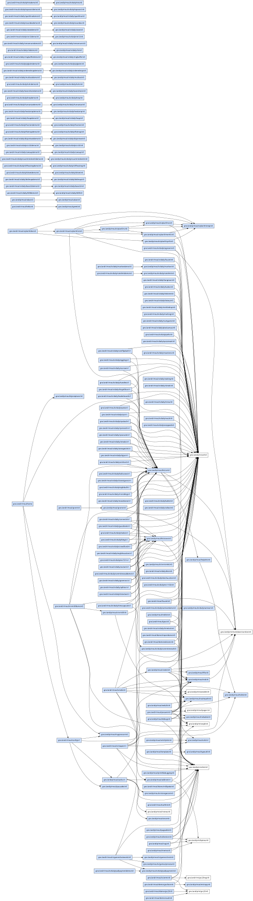

# moul/gno-contracts

[](https://github.com/moul/gno-contracts/actions/workflows/ci.yml)

**moul's personal [gno.land](https://gno.land) contracts**: every `p/moul/*` package and
`r/moul/*` realm, developed in one place, **versioned from day one**, **self-contained**
(dependencies vendored) and **continuously tested against gno master**.

This repository is the home of contracts that used to live in the `gnolang/gno` monorepo
under `examples/gno.land/{p,r}/moul/*`. One `git clone` plus a gno toolchain is enough to
build, test, lint and publish everything.

## Features

- **Mandatory versioning.** Every contract is `.../<name>/vN`, and a breaking change ships
  as a new `vN` rather than an in-place edit. The version lives in the package's
  `gnomod.toml`, **not** in its directory name, so a bump is a one-line change plus the
  real content diff instead of a directory copy git cannot pair. The version it replaces
  is pinned in [`gnomod.lock`](./gnomod.lock) and rebuilt from history on demand (see
  [gnopm](https://github.com/moul/gnopm)). Originals that no longer build on master are
  kept as `ignore = true`: archived, 💤, skipped by CI.
- **Autonomous builds.** External `gno.land/*` deps are vendored and only the gno stdlibs
  come from the toolchain, so one clone builds offline and independently of monorepo
  drift.
- **CI against gno master.** Every package is `gno lint`ed and `gno test`ed on each pull
  request, and `make sync` reports drift from the upstream monorepo copies.
- **Self-maintaining catalog.** [`contracts.json`](./contracts.json), the table below,
  every per-package README footer and the `_assets/` graphs are **regenerated after merge**
  by a workflow, so pull requests carry only source and never conflict on generated files.
- **Dependency graphs**, per package, latest-version-only (embedded below) and full, in
  [`_assets/`](./_assets).
- **On-chain status.** The table shows where each contract is published (✅ our versioned
  path, 🗄️ the monorepo's un-versioned copy), refreshed hourly. A chain that is unreachable
  is skipped rather than recorded as hosting nothing.
- **One pull request bot, one comment**: counts, sizes, test counts and ⚠️/🔥 signals on
  three lines, everything per-package folded away. It also reconciles the path labels
  (`p`/`r`/`meta`) and links the live realm preview.
- **Publishing.** `make publish` asks the chain what is missing, orders it by dependency and
  runs `gnokey` once per package with your terminal attached. It never signs on your behalf;
  `PRINT=1` writes the commands out and runs nothing.

### 🖼️ Realm previews on every pull request

A pull request touching a realm gets it rendered with **gnodev into static gnoweb** and
published to `https://moul.github.io/gno-contracts-previews/pr-<N>/`, linked from the bot
comment, so a reviewer can *see* the output without checking the branch out. Every package
on `main` is at
[the same site's `main/`](https://moul.github.io/gno-contracts-previews/main/). A preview
outlives its pull request by three weeks, because the comment embeds its screenshots by
URL. Locally: `make preview ARGS="./r/moul/home"`, then serve `_preview/`.

## Layout

```
p/moul/<name>/          packages            -> gno.land/p/moul/<name>/vN
r/moul/<name>/          realms              -> gno.land/r/moul/<name>/vN
vendor/gno.land/...     vendored deps (committed, autonomous)
tools/                  the Go tools: gnocontracts, gnohome, gnoblog, pairgen
contracts.json          the catalog, source of truth for the table below
gnomod.lock             where every version's source is (committed, hand-owned)
gnowork.toml            workspace marker (enables local package resolution)
.gnopm/                 superseded versions, rebuilt from history (gitignored)
Makefile                one line per target; `make help` groups them
```

The directory does **not** carry the version; the `module` line in its `gnomod.toml` does.
`p/moul/md/` declaring `module = "gno.land/p/moul/md/v1"` publishes to
`gno.land/p/moul/md/v1`. The gno toolchain resolves a workspace import from that line and
ignores the directory name entirely.

### Versioning (mandatory)

**Every** contract has an explicit version segment in its **package path**, starting at
**`v0`**, gno's own convention for *initial, unaudited*
([gnolang/gno#5220](https://github.com/gnolang/gno/issues/5220)), then `/v1`, `/v2`. The
version is always the LAST path element: `gno.land/p/moul/ulist/lplist/v0`, never
`gno.land/p/moul/ulist/v0/lplist`.

```
p/moul/md/gnomod.toml     module = "gno.land/p/moul/md/v1"
p/moul/md/md.gno          edited in place, git diffs it properly
```

A breaking change is a bump, `gnopm bump md`: one line in `gnomod.toml`, then the real
edit. The version it replaces keeps working for existing callers, pinned in
[`gnomod.lock`](./gnomod.lock) to the commit that still holds it and rebuilt into `.gnopm/`
on demand, so anything still importing `.../md/v0` resolves, lints and tests exactly as
before. Non-breaking work, new functions, tests, comments and docs, edits the current
version in place.

This used to be a directory copy, `p/moul/md/v0` to `p/moul/md/v1`, files and all. git
pairs nothing across a copy, so the review diff of a version bump was a pile of added
files with no content diff at all: precisely backwards, since a bump is by definition the
change that most needs reviewing. One port of 25 realms landed as +11,103 / 0 across 112
files. See [gnopm](https://github.com/moul/gnopm) for the format and the reasoning.

### Autonomy (vendored dependencies)

`gnowork.toml` makes the whole repo one gno workspace, so `gno.land/p/moul/*` imports
resolve locally. External `gno.land/*` dependencies are copied into `vendor/gno.land/...`,
each with its `gnomod.toml`, by `make deps`, so the repo resolves them without relying on
`$GNOROOT/examples`. Only the gno **stdlibs** come from the toolchain.

## Usage

```sh
export GNOROOT=/path/to/gnolang/gno   # a gno master checkout (stdlibs + the gno binary)

make help                             # every target, grouped
make lint test                        # the gate: lint, the guards, and every test
make test PKG=x/daily/b58             # narrow any of them to one package
make deps                             # vendor external dependencies into vendor/
make sync                             # drift vs the monorepo: did someone change my contract?
make publish PRINT=1 KEY=moul          # the dependency-ordered plan, running nothing
make publish KEY=moul PKG=kit/store    # publish that package and what it imports
```

## Contracts

<!-- BEGIN CONTRACTS TABLE (generated by `make readme`; do not edit by hand) -->

| Package | pearl | mainnet | staging | Monorepo | Deps |
|---|---|---|---|---|---|
| [`p/moul/addrset/v0`](https://github.com/moul/gno-contracts/tree/3d07a5b2cc02d7c3769caff0c17d884ac033bcfe/p/moul/addrset/v0) 📦 🧊 | — | [🗄️](https://gno.land/p/moul/addrset/v0) | — | [src](https://github.com/gnolang/gno/tree/master/examples/gno.land/p/moul/addrset/v0) ≈ | 1 |
| [`p/moul/addrset/v1`](p/moul/addrset) 📦 | [✅](https://pearl.testnets.gno.land/p/moul/addrset/v1) | [✅](https://gno.land/p/moul/addrset/v1) | — | — | 1 |
| [`p/moul/agents/commit/v0`](p/moul/agents/commit) 📦 | — | [✅](https://gno.land/p/moul/agents/commit/v0) | — | — | — |
| [`p/moul/authz/v0`](https://github.com/moul/gno-contracts/tree/3d07a5b2cc02d7c3769caff0c17d884ac033bcfe/p/moul/authz/v0) 📦 🧊 | — | [🗄️](https://gno.land/p/moul/authz/v0) | — | [src](https://github.com/gnolang/gno/tree/master/examples/gno.land/p/moul/authz/v0) ≈ | 5 |
| [`p/moul/authz/v1`](p/moul/authz) 📦 | [✅](https://pearl.testnets.gno.land/p/moul/authz/v1) | [✅](https://gno.land/p/moul/authz/v1) | — | — | 3 |
| [`p/moul/collection/v0`](p/moul/collection) 📦 | — | [✅](https://gno.land/p/moul/collection/v0) | — | — | 3 |
| [`p/moul/cow/v0`](p/moul/cow) 📦 | — | [✅](https://gno.land/p/moul/cow/v0) | — | — | — |
| [`p/moul/debug/v0`](p/moul/debug) 📦 | — | [✅](https://gno.land/p/moul/debug/v0) | — | — | 4 |
| [`p/moul/deque/v0`](p/moul/deque) 📦 | — | [✅](https://gno.land/p/moul/deque/v0) | — | — | — |
| [`p/moul/dynreplacer/v0`](p/moul/dynreplacer) 📦 | — | [🗄️](https://gno.land/p/moul/dynreplacer/v0) | — | [src](https://github.com/gnolang/gno/tree/master/examples/gno.land/p/moul/dynreplacer/v0) ≈ | — |
| [`p/moul/entity/v0`](p/moul/entity) 📦 | — | [✅](https://gno.land/p/moul/entity/v0) | — | — | — |
| [`p/moul/entropy/v0`](p/moul/entropy) 📦 | — | [✅](https://gno.land/p/moul/entropy/v0) | — | — | — |
| [`p/moul/errs/v0`](p/moul/errs) 📦 | — | [✅](https://gno.land/p/moul/errs/v0) | — | — | — |
| [`p/moul/fifo/v0`](p/moul/fifo) 📦 | — | [🗄️](https://gno.land/p/moul/fifo/v0) | — | [src](https://github.com/gnolang/gno/tree/master/examples/gno.land/p/moul/fifo/v0) ≈ | — |
| [`p/moul/forge/v0`](p/moul/forge) 📦 | — | [✅](https://gno.land/p/moul/forge/v0) | — | — | 1 |
| [`p/moul/fp/v0`](p/moul/fp) 📦 | — | [✅](https://gno.land/p/moul/fp/v0) | — | — | — |
| [`p/moul/grants/v0`](p/moul/grants) 📦 | — | [✅](https://gno.land/p/moul/grants/v0) | — | — | 3 |
| [`p/moul/greet/v0`](p/moul/greet) 📦 | — | [✅](https://gno.land/p/moul/greet/v0) | — | — | — |
| [`p/moul/helplink/v0`](p/moul/helplink) 📦 | — | [🗄️](https://gno.land/p/moul/helplink/v0) | — | [src](https://github.com/gnolang/gno/tree/master/examples/gno.land/p/moul/helplink/v0) ≈ | 1 |
| [`p/moul/kit/store/v0`](p/moul/kit/store) 📦 | — | [✅](https://gno.land/p/moul/kit/store/v0) | — | — | 2 |
| [`p/moul/kit/ui/v0`](p/moul/kit/ui) 📦 | — | [✅](https://gno.land/p/moul/kit/ui/v0) | — | — | 3 |
| [`p/moul/md/v0`](p/moul/md) 📦 | — | [🗄️](https://gno.land/p/moul/md/v0) | — | [src](https://github.com/gnolang/gno/tree/master/examples/gno.land/p/moul/md/v0) ≈ | 1 |
| [`p/moul/mdlist/v0`](p/moul/mdlist) 📦 | — | [✅](https://gno.land/p/moul/mdlist/v0) | — | — | 1 |
| [`p/moul/mdtable/v0`](p/moul/mdtable) 📦 | — | [🗄️](https://gno.land/p/moul/mdtable/v0) | — | [src](https://github.com/gnolang/gno/tree/master/examples/gno.land/p/moul/mdtable/v0) ≈ | — |
| [`p/moul/memo/v0`](p/moul/memo) 📦 | — | [✅](https://gno.land/p/moul/memo/v0) | — | — | 2 |
| [`p/moul/mygnoscan/v0`](p/moul/mygnoscan) 📦 | — | [✅](https://gno.land/p/moul/mygnoscan/v0) | — | — | — |
| [`p/moul/nestedpkg/v0`](p/moul/nestedpkg) 📦 | — | [✅](https://gno.land/p/moul/nestedpkg/v0) | — | — | — |
| [`p/moul/once/v0`](p/moul/once) 📦 | — | [🗄️](https://gno.land/p/moul/once/v0) | — | [src](https://github.com/gnolang/gno/tree/master/examples/gno.land/p/moul/once/v0) ≈ | — |
| [`p/moul/ownable/v0`](p/moul/ownable) 📦 | — | [✅](https://gno.land/p/moul/ownable/v0) | — | — | — |
| [`p/moul/pageable/v0`](p/moul/pageable) 📦 | — | [✅](https://gno.land/p/moul/pageable/v0) | — | — | 1 |
| [`p/moul/pausable/v0`](p/moul/pausable) 📦 | — | [✅](https://gno.land/p/moul/pausable/v0) | — | — | — |
| [`p/moul/printfdebugging/v0`](p/moul/printfdebugging) 📦 | — | [✅](https://gno.land/p/moul/printfdebugging/v0) | — | — | 1 |
| [`p/moul/realmpath/v0`](p/moul/realmpath) 📦 | — | [🗄️](https://gno.land/p/moul/realmpath/v0) | — | [src](https://github.com/gnolang/gno/tree/master/examples/gno.land/p/moul/realmpath/v0) ≈ | — |
| [`p/moul/safe/v0`](p/moul/safe) 📦 | — | [✅](https://gno.land/p/moul/safe/v0) | — | — | — |
| [`p/moul/svg/v0`](p/moul/svg) 📦 | — | [✅](https://gno.land/p/moul/svg/v0) | — | — | 2 |
| [`p/moul/template/v0`](p/moul/template) 📦 | — | [✅](https://gno.land/p/moul/template/v0) | — | — | 3 |
| [`p/moul/txlink/v0`](p/moul/txlink) 📦 | — | [🗄️](https://gno.land/p/moul/txlink/v0) | — | [src](https://github.com/gnolang/gno/tree/master/examples/gno.land/p/moul/txlink/v0) ≈ | — |
| [`p/moul/typeutil/v0`](p/moul/typeutil) 📦 | — | [🗄️](https://gno.land/p/moul/typeutil/v0) | — | [src](https://github.com/gnolang/gno/tree/master/examples/gno.land/p/moul/typeutil/v0) ≈ | — |
| [`p/moul/udao/v0`](p/moul/udao) 📦 | — | [✅](https://gno.land/p/moul/udao/v0) | — | — | — |
| [`p/moul/ulist/lplist/v0`](p/moul/ulist/lplist) 📦 | — | [✅](https://gno.land/p/moul/ulist/lplist/v0) | — | — | 1 |
| [`p/moul/ulist/v0`](https://github.com/moul/gno-contracts/tree/f6d0693f5161db423c042a4fe7c78057593cff80/p/moul/ulist) 📦 🧊 | — | [🗄️](https://gno.land/p/moul/ulist/v0) | — | [src](https://github.com/gnolang/gno/tree/master/examples/gno.land/p/moul/ulist/v0) ≈ | — |
| [`p/moul/ulist/v1`](p/moul/ulist) 📦 | [✅](https://pearl.testnets.gno.land/p/moul/ulist/v1) | [✅](https://gno.land/p/moul/ulist/v1) | — | — | — |
| [`p/moul/vesting/v0`](p/moul/vesting) 📦 | — | [✅](https://gno.land/p/moul/vesting/v0) | — | — | — |
| [`p/moul/web25/v0`](p/moul/web25) 📦 | — | [✅](https://gno.land/p/moul/web25/v0) | — | — | 1 |
| [`p/moul/x/daily/b58/v0`](p/moul/x/daily/b58) 📦 | — | [✅](https://gno.land/p/moul/x/daily/b58/v0) | — | — | — |
| [`p/moul/x/daily/base32/v0`](p/moul/x/daily/base32) 📦 | — | [✅](https://gno.land/p/moul/x/daily/base32/v0) | — | — | — |
| [`p/moul/x/daily/bidimap/v0`](p/moul/x/daily/bidimap) 📦 | — | [✅](https://gno.land/p/moul/x/daily/bidimap/v0) | — | — | — |
| [`p/moul/x/daily/bitset/v0`](p/moul/x/daily/bitset) 📦 | — | [✅](https://gno.land/p/moul/x/daily/bitset/v0) | — | — | — |
| [`p/moul/x/daily/cliffvesting/v0`](https://github.com/moul/gno-contracts/tree/d9879cdf25236a55f92c93fbb523faad01c1e7ae/p/moul/x/daily/cliffvesting) 📦 🧊 | — | [✅](https://gno.land/p/moul/x/daily/cliffvesting/v0) | — | — | — |
| [`p/moul/x/daily/cliffvesting/v1`](p/moul/x/daily/cliffvesting) 📦 | — | [✅](https://gno.land/p/moul/x/daily/cliffvesting/v1) | — | — | — |
| [`p/moul/x/daily/commitreveal/v0`](p/moul/x/daily/commitreveal) 📦 | — | [✅](https://gno.land/p/moul/x/daily/commitreveal/v0) | — | — | — |
| [`p/moul/x/daily/countminsketch/v0`](p/moul/x/daily/countminsketch) 📦 | — | [✅](https://gno.land/p/moul/x/daily/countminsketch/v0) | — | — | — |
| [`p/moul/x/daily/cowsay/v0`](p/moul/x/daily/cowsay) 📦 | — | [✅](https://gno.land/p/moul/x/daily/cowsay/v0) | — | — | — |
| [`p/moul/x/daily/crc32/v0`](p/moul/x/daily/crc32) 📦 | — | [✅](https://gno.land/p/moul/x/daily/crc32/v0) | — | — | — |
| [`p/moul/x/daily/disjointset/v0`](p/moul/x/daily/disjointset) 📦 | — | [✅](https://gno.land/p/moul/x/daily/disjointset/v0) | — | — | — |
| [`p/moul/x/daily/flatmap/v0`](p/moul/x/daily/flatmap) 📦 | — | [✅](https://gno.land/p/moul/x/daily/flatmap/v0) | — | — | — |
| [`p/moul/x/daily/fraction/v0`](p/moul/x/daily/fraction) 📦 | — | [✅](https://gno.land/p/moul/x/daily/fraction/v0) | — | — | — |
| [`p/moul/x/daily/heap/v0`](p/moul/x/daily/heap) 📦 | — | [✅](https://gno.land/p/moul/x/daily/heap/v0) | — | — | — |
| [`p/moul/x/daily/hexdump/v0`](p/moul/x/daily/hexdump) 📦 | — | [✅](https://gno.land/p/moul/x/daily/hexdump/v0) | — | — | — |
| [`p/moul/x/daily/humanize/v0`](p/moul/x/daily/humanize) 📦 | — | [✅](https://gno.land/p/moul/x/daily/humanize/v0) | — | — | — |
| [`p/moul/x/daily/kmp/v0`](p/moul/x/daily/kmp) 📦 | — | [✅](https://gno.land/p/moul/x/daily/kmp/v0) | — | — | — |
| [`p/moul/x/daily/levenshtein/v0`](p/moul/x/daily/levenshtein) 📦 | — | [✅](https://gno.land/p/moul/x/daily/levenshtein/v0) | — | — | — |
| [`p/moul/x/daily/luhn/v0`](p/moul/x/daily/luhn) 📦 | — | [✅](https://gno.land/p/moul/x/daily/luhn/v0) | — | — | — |
| [`p/moul/x/daily/markov/v0`](p/moul/x/daily/markov) 📦 | — | [✅](https://gno.land/p/moul/x/daily/markov/v0) | — | — | 1 |
| [`p/moul/x/daily/multiset/v0`](p/moul/x/daily/multiset) 📦 | — | [✅](https://gno.land/p/moul/x/daily/multiset/v0) | — | — | — |
| [`p/moul/x/daily/orderedmap/v0`](p/moul/x/daily/orderedmap) 📦 | — | [✅](https://gno.land/p/moul/x/daily/orderedmap/v0) | — | — | — |
| [`p/moul/x/daily/piglatin/v0`](p/moul/x/daily/piglatin) 📦 | — | [✅](https://gno.land/p/moul/x/daily/piglatin/v0) | — | — | — |
| [`p/moul/x/daily/pullpayment/v0`](p/moul/x/daily/pullpayment) 📦 | — | [✅](https://gno.land/p/moul/x/daily/pullpayment/v0) | — | — | — |
| [`p/moul/x/daily/ratelimit/v0`](p/moul/x/daily/ratelimit) 📦 | — | [✅](https://gno.land/p/moul/x/daily/ratelimit/v0) | — | — | 1 |
| [`p/moul/x/daily/ringbuffer/v0`](p/moul/x/daily/ringbuffer) 📦 | — | [✅](https://gno.land/p/moul/x/daily/ringbuffer/v0) | — | — | — |
| [`p/moul/x/daily/rle/v0`](p/moul/x/daily/rle) 📦 | — | [✅](https://gno.land/p/moul/x/daily/rle/v0) | — | — | — |
| [`p/moul/x/daily/romannum/v0`](p/moul/x/daily/romannum) 📦 | — | [✅](https://gno.land/p/moul/x/daily/romannum/v0) | — | — | — |
| [`p/moul/x/daily/rot13/v0`](p/moul/x/daily/rot13) 📦 | — | [✅](https://gno.land/p/moul/x/daily/rot13/v0) | — | — | — |
| [`p/moul/x/daily/semver/v0`](p/moul/x/daily/semver) 📦 | — | [✅](https://gno.land/p/moul/x/daily/semver/v0) | — | — | — |
| [`p/moul/x/daily/sieve/v0`](p/moul/x/daily/sieve) 📦 | — | [✅](https://gno.land/p/moul/x/daily/sieve/v0) | — | — | — |
| [`p/moul/x/daily/soundex/v0`](p/moul/x/daily/soundex) 📦 | — | [✅](https://gno.land/p/moul/x/daily/soundex/v0) | — | — | — |
| [`p/moul/x/daily/sparkline/v0`](p/moul/x/daily/sparkline) 📦 | — | [✅](https://gno.land/p/moul/x/daily/sparkline/v0) | — | — | — |
| [`p/moul/x/daily/toposort/v0`](p/moul/x/daily/toposort) 📦 | — | [✅](https://gno.land/p/moul/x/daily/toposort/v0) | — | — | — |
| [`p/moul/x/daily/trie/v0`](p/moul/x/daily/trie) 📦 | — | [✅](https://gno.land/p/moul/x/daily/trie/v0) | — | — | — |
| [`p/moul/x/framelab/v0`](p/moul/x/framelab) 📦 | — | [✅](https://gno.land/p/moul/x/framelab/v0) | — | — | 1 |
| [`p/moul/x/games/clock/v0`](p/moul/x/games/clock) 📦 | — | [✅](https://gno.land/p/moul/x/games/clock/v0) | — | — | — |
| [`p/moul/x/games/prorata/v0`](p/moul/x/games/prorata) 📦 | — | [✅](https://gno.land/p/moul/x/games/prorata/v0) | — | — | — |
| [`p/moul/x/grc20wrap/v0`](p/moul/x/grc20wrap) 📦 | — | [✅](https://gno.land/p/moul/x/grc20wrap/v0) | — | — | 3 |
| [`p/moul/x/merkle/v0`](p/moul/x/merkle) 📦 | — | [✅](https://gno.land/p/moul/x/merkle/v0) | — | — | — |
| [`p/moul/x/mmr/v0`](p/moul/x/mmr) 📦 | — | [✅](https://gno.land/p/moul/x/mmr/v0) | — | — | 1 |
| [`p/moul/x/pair/v0`](p/moul/x/pair) 📦 | — | [✅](https://gno.land/p/moul/x/pair/v0) | — | — | 3 |
| [`p/moul/x/plan9/memfs/v0`](p/moul/x/plan9/memfs) 📦 | — | [✅](https://gno.land/p/moul/x/plan9/memfs/v0) | — | — | 2 |
| [`p/moul/x/plan9/ninep/v0`](p/moul/x/plan9/ninep) 📦 | — | [✅](https://gno.land/p/moul/x/plan9/ninep/v0) | — | — | — |
| [`p/moul/x/plan9/ns/v0`](p/moul/x/plan9/ns) 📦 | — | [✅](https://gno.land/p/moul/x/plan9/ns/v0) | — | — | 2 |
| [`p/moul/x/plan9/rc/v0`](p/moul/x/plan9/rc) 📦 | — | [✅](https://gno.land/p/moul/x/plan9/rc/v0) | — | — | 3 |
| [`p/moul/x/plan9/synfs/v0`](p/moul/x/plan9/synfs) 📦 | — | [✅](https://gno.land/p/moul/x/plan9/synfs/v0) | — | — | 2 |
| [`p/moul/x/storagecost/v0`](p/moul/x/storagecost) 📦 | — | [✅](https://gno.land/p/moul/x/storagecost/v0) | — | — | 1 |
| [`p/moul/x/vm/bf/v0`](p/moul/x/vm/bf) 📦 | — | [✅](https://gno.land/p/moul/x/vm/bf/v0) | — | — | 2 |
| [`p/moul/x/vm/riscv/v0`](p/moul/x/vm/riscv) 📦 | — | — | — | — | 1 |
| [`p/moul/x/vm/vmkit/v0`](p/moul/x/vm/vmkit) 📦 | — | [✅](https://gno.land/p/moul/x/vm/vmkit/v0) | — | — | 1 |
| [`p/moul/x/wesh/v0`](p/moul/x/wesh) 📦 | — | [✅](https://gno.land/p/moul/x/wesh/v0) | — | — | 1 |
| [`p/moul/x/wiki/v0`](p/moul/x/wiki) 📦 | — | [✅](https://gno.land/p/moul/x/wiki/v0) | — | — | 6 |
| [`p/moul/xdao/v0`](p/moul/xdao) 📦 | — | [✅](https://gno.land/p/moul/xdao/v0) | — | — | 1 |
| [`p/moul/xmath/v0`](p/moul/xmath) 📦 | — | [✅](https://gno.land/p/moul/xmath/v0) | — | — | — |
| [`r/moul/agents/capwallet/v0`](r/moul/agents/capwallet) 🏛️ | — | [✅](https://gno.land/r/moul/agents/capwallet/v0) | — | — | 1 |
| [`r/moul/agents/gnomem/v0`](r/moul/agents/gnomem) 🏛️ | — | [✅](https://gno.land/r/moul/agents/gnomem/v0) | — | — | 1 |
| [`r/moul/agents/jury/v0`](r/moul/agents/jury) 🏛️ | — | [✅](https://gno.land/r/moul/agents/jury/v0) | — | — | 2 |
| [`r/moul/agents/maintainer/v0`](r/moul/agents/maintainer) 🏛️ | — | [✅](https://gno.land/r/moul/agents/maintainer/v0) | — | — | 1 |
| [`r/moul/agents/passport/v0`](r/moul/agents/passport) 🏛️ | — | [✅](https://gno.land/r/moul/agents/passport/v0) | — | — | 2 |
| [`r/moul/agents/receipt/v0`](r/moul/agents/receipt) 🏛️ | — | [✅](https://gno.land/r/moul/agents/receipt/v0) | — | — | 1 |
| [`r/moul/blog`](r/moul/blog) 🏛️ | — | [✅](https://gno.land/r/moul/blog) | — | — | 3 |
| [`r/moul/config/v0`](https://github.com/moul/gno-contracts/tree/bd1ff5de0053958282ac81f08ed8bfcb2081982c/r/moul/config) 🏛️ 🧊 | — | [✅](https://gno.land/r/moul/config/v0) | — | — | 1 |
| [`r/moul/config/v1`](r/moul/config) 🏛️ | — | [✅](https://gno.land/r/moul/config/v1) | — | — | 4 |
| [`r/moul/demo/args/v0`](r/moul/demo/args) 🏛️ | — | [✅](https://gno.land/r/moul/demo/args/v0) | — | — | — |
| [`r/moul/demo/data/v0`](r/moul/demo/data) 🏛️ | — | [✅](https://gno.land/r/moul/demo/data/v0) | — | — | — |
| [`r/moul/demo/gnoface/v0`](r/moul/demo/gnoface) 🏛️ | — | [✅](https://gno.land/r/moul/demo/gnoface/v0) | — | — | 2 |
| [`r/moul/demo/grc20/v0`](r/moul/demo/grc20) 🏛️ | — | [✅](https://gno.land/r/moul/demo/grc20/v0) | — | — | 1 |
| [`r/moul/demo/hello/v0`](r/moul/demo/hello) 🏛️ | — | [✅](https://gno.land/r/moul/demo/hello/v0) | — | — | — |
| [`r/moul/demo/importdemo/v0`](r/moul/demo/importdemo) 🏛️ | — | [✅](https://gno.land/r/moul/demo/importdemo/v0) | — | — | 2 |
| [`r/moul/demo/microposts/v0`](r/moul/demo/microposts) 🏛️ | — | [✅](https://gno.land/r/moul/demo/microposts/v0) | — | — | — |
| [`r/moul/demo/millipede/v0`](r/moul/demo/millipede) 🏛️ | — | [✅](https://gno.land/r/moul/demo/millipede/v0) | — | — | 1 |
| [`r/moul/demo/render/v0`](r/moul/demo/render) 🏛️ | — | [✅](https://gno.land/r/moul/demo/render/v0) | — | — | — |
| [`r/moul/demo/vault/v0`](r/moul/demo/vault) 🏛️ | — | [✅](https://gno.land/r/moul/demo/vault/v0) | — | — | 1 |
| [`r/moul/demo/wikicoin/v0`](r/moul/demo/wikicoin) 🏛️ | — | [✅](https://gno.land/r/moul/demo/wikicoin/v0) | — | — | 2 |
| [`r/moul/faucet/v0`](r/moul/faucet) 🏛️ | — | [✅](https://gno.land/r/moul/faucet/v0) | — | — | 2 |
| [`r/moul/forge/v0`](r/moul/forge) 🏛️ | — | [✅](https://gno.land/r/moul/forge/v0) | — | — | 5 |
| [`r/moul/gns/v0`](r/moul/gns) 🏛️ | — | [✅](https://gno.land/r/moul/gns/v0) | — | — | 2 |
| [`r/moul/grant/v0`](r/moul/grant) 🏛️ | — | [✅](https://gno.land/r/moul/grant/v0) | — | — | 1 |
| [`r/moul/hello/v0`](r/moul/hello) 🏛️ | — | [✅](https://gno.land/r/moul/hello/v0) | — | — | 1 |
| [`r/moul/home`](r/moul/home) 🏛️ | — | [✅](https://gno.land/r/moul/home) | — | — | 4 |
| [`r/moul/home/v0`](https://github.com/moul/gno-contracts/tree/4f2df83869b80470eb81c48a82fdbe82256b8113/r/moul/home) 🏛️ 🧊 | — | — | — | — | — |
| [`r/moul/outfmt/v0`](r/moul/outfmt) 🏛️ | — | [✅](https://gno.land/r/moul/outfmt/v0) | — | — | 1 |
| [`r/moul/present/v0`](r/moul/present) 🏛️ | — | [✅](https://gno.land/r/moul/present/v0) | — | — | 9 |
| [`r/moul/sapin/v0`](r/moul/sapin) 🏛️ | — | [✅](https://gno.land/r/moul/sapin/v0) | — | — | — |
| [`r/moul/vesting/v0`](r/moul/vesting) 🏛️ | — | [✅](https://gno.land/r/moul/vesting/v0) | — | — | 5 |
| [`r/moul/x/allinone/devtools/v0`](r/moul/x/allinone/devtools) 🏛️ | — | [✅](https://gno.land/r/moul/x/allinone/devtools/v0) | — | — | 8 |
| [`r/moul/x/allinone/textlab/v0`](r/moul/x/allinone/textlab) 🏛️ | — | [✅](https://gno.land/r/moul/x/allinone/textlab/v0) | — | — | 9 |
| [`r/moul/x/amm/v0`](r/moul/x/amm) 🏛️ | — | [✅](https://gno.land/r/moul/x/amm/v0) | — | — | 5 |
| [`r/moul/x/daily/asciiart/v0`](https://github.com/moul/gno-contracts/tree/4f2df83869b80470eb81c48a82fdbe82256b8113/r/moul/x/daily/asciiart) 🏛️ 🧊 | — | [✅](https://gno.land/r/moul/x/daily/asciiart/v0) | — | — | 1 |
| [`r/moul/x/daily/asciiart/v1`](r/moul/x/daily/asciiart) 🏛️ | [✅](https://pearl.testnets.gno.land/r/moul/x/daily/asciiart/v1) | [✅](https://gno.land/r/moul/x/daily/asciiart/v1) | — | — | 2 |
| [`r/moul/x/daily/b58demo/v0`](r/moul/x/daily/b58demo) 🏛️ | — | [✅](https://gno.land/r/moul/x/daily/b58demo/v0) | — | — | 1 |
| [`r/moul/x/daily/ballot/v0`](r/moul/x/daily/ballot) 🏛️ | — | [✅](https://gno.land/r/moul/x/daily/ballot/v0) | — | — | 1 |
| [`r/moul/x/daily/base32demo/v0`](r/moul/x/daily/base32demo) 🏛️ | — | [✅](https://gno.land/r/moul/x/daily/base32demo/v0) | — | — | 1 |
| [`r/moul/x/daily/bidimapdemo/v0`](r/moul/x/daily/bidimapdemo) 🏛️ | — | [✅](https://gno.land/r/moul/x/daily/bidimapdemo/v0) | — | — | 1 |
| [`r/moul/x/daily/bitsetdemo/v0`](r/moul/x/daily/bitsetdemo) 🏛️ | — | [✅](https://gno.land/r/moul/x/daily/bitsetdemo/v0) | — | — | 1 |
| [`r/moul/x/daily/blog/v0`](https://github.com/moul/gno-contracts/tree/4f2df83869b80470eb81c48a82fdbe82256b8113/r/moul/x/daily/blog) 🏛️ 🧊 | — | [✅](https://gno.land/r/moul/x/daily/blog/v0) | — | — | 1 |
| [`r/moul/x/daily/blog/v1`](r/moul/x/daily/blog) 🏛️ | [✅](https://pearl.testnets.gno.land/r/moul/x/daily/blog/v1) | [✅](https://gno.land/r/moul/x/daily/blog/v1) | — | — | 1 |
| [`r/moul/x/daily/bloomfilter/v0`](r/moul/x/daily/bloomfilter) 🏛️ | — | [✅](https://gno.land/r/moul/x/daily/bloomfilter/v0) | — | — | — |
| [`r/moul/x/daily/bullscows/v0`](https://github.com/moul/gno-contracts/tree/4f2df83869b80470eb81c48a82fdbe82256b8113/r/moul/x/daily/bullscows) 🏛️ 🧊 | — | [✅](https://gno.land/r/moul/x/daily/bullscows/v0) | — | — | — |
| [`r/moul/x/daily/bullscows/v1`](r/moul/x/daily/bullscows) 🏛️ | [✅](https://pearl.testnets.gno.land/r/moul/x/daily/bullscows/v1) | [✅](https://gno.land/r/moul/x/daily/bullscows/v1) | — | — | 1 |
| [`r/moul/x/daily/calc/v0`](r/moul/x/daily/calc) 🏛️ | — | [✅](https://gno.land/r/moul/x/daily/calc/v0) | — | — | — |
| [`r/moul/x/daily/cliffvestingdemo/v0`](https://github.com/moul/gno-contracts/tree/d9879cdf25236a55f92c93fbb523faad01c1e7ae/r/moul/x/daily/cliffvestingdemo) 🏛️ 🧊 | — | [✅](https://gno.land/r/moul/x/daily/cliffvestingdemo/v0) | — | — | 1 |
| [`r/moul/x/daily/cliffvestingdemo/v1`](r/moul/x/daily/cliffvestingdemo) 🏛️ | — | [✅](https://gno.land/r/moul/x/daily/cliffvestingdemo/v1) | — | — | 1 |
| [`r/moul/x/daily/closestguess/v0`](https://github.com/moul/gno-contracts/tree/4f2df83869b80470eb81c48a82fdbe82256b8113/r/moul/x/daily/closestguess) 🏛️ 🧊 | — | [✅](https://gno.land/r/moul/x/daily/closestguess/v0) | — | — | — |
| [`r/moul/x/daily/closestguess/v1`](r/moul/x/daily/closestguess) 🏛️ | — | [✅](https://gno.land/r/moul/x/daily/closestguess/v1) | — | — | 1 |
| [`r/moul/x/daily/coinflipduel/v0`](https://github.com/moul/gno-contracts/tree/4f2df83869b80470eb81c48a82fdbe82256b8113/r/moul/x/daily/coinflipduel) 🏛️ 🧊 | — | [✅](https://gno.land/r/moul/x/daily/coinflipduel/v0) | — | — | 1 |
| [`r/moul/x/daily/coinflipduel/v1`](r/moul/x/daily/coinflipduel) 🏛️ | [✅](https://pearl.testnets.gno.land/r/moul/x/daily/coinflipduel/v1) | [✅](https://gno.land/r/moul/x/daily/coinflipduel/v1) | — | — | 2 |
| [`r/moul/x/daily/collatz/v0`](r/moul/x/daily/collatz) 🏛️ | — | [✅](https://gno.land/r/moul/x/daily/collatz/v0) | — | — | 1 |
| [`r/moul/x/daily/commitrevealdemo/v0`](https://github.com/moul/gno-contracts/tree/4f2df83869b80470eb81c48a82fdbe82256b8113/r/moul/x/daily/commitrevealdemo) 🏛️ 🧊 | — | [✅](https://gno.land/r/moul/x/daily/commitrevealdemo/v0) | — | — | 1 |
| [`r/moul/x/daily/commitrevealdemo/v1`](r/moul/x/daily/commitrevealdemo) 🏛️ | — | [✅](https://gno.land/r/moul/x/daily/commitrevealdemo/v1) | — | — | 2 |
| [`r/moul/x/daily/connect4/v0`](https://github.com/moul/gno-contracts/tree/4f2df83869b80470eb81c48a82fdbe82256b8113/r/moul/x/daily/connect4) 🏛️ 🧊 | — | [✅](https://gno.land/r/moul/x/daily/connect4/v0) | — | — | 1 |
| [`r/moul/x/daily/connect4/v1`](r/moul/x/daily/connect4) 🏛️ | [✅](https://pearl.testnets.gno.land/r/moul/x/daily/connect4/v1) | [✅](https://gno.land/r/moul/x/daily/connect4/v1) | — | — | 2 |
| [`r/moul/x/daily/counter/v0`](r/moul/x/daily/counter) 🏛️ | — | [✅](https://gno.land/r/moul/x/daily/counter/v0) | — | — | — |
| [`r/moul/x/daily/countminsketchdemo/v0`](r/moul/x/daily/countminsketchdemo) 🏛️ | — | [✅](https://gno.land/r/moul/x/daily/countminsketchdemo/v0) | — | — | 1 |
| [`r/moul/x/daily/cowsaydemo/v0`](r/moul/x/daily/cowsaydemo) 🏛️ | — | [✅](https://gno.land/r/moul/x/daily/cowsaydemo/v0) | — | — | 1 |
| [`r/moul/x/daily/crc32demo/v0`](r/moul/x/daily/crc32demo) 🏛️ | — | [✅](https://gno.land/r/moul/x/daily/crc32demo/v0) | — | — | 1 |
| [`r/moul/x/daily/crowdfund/v0`](https://github.com/moul/gno-contracts/tree/4f2df83869b80470eb81c48a82fdbe82256b8113/r/moul/x/daily/crowdfund) 🏛️ 🧊 | — | [✅](https://gno.land/r/moul/x/daily/crowdfund/v0) | — | — | 1 |
| [`r/moul/x/daily/crowdfund/v1`](r/moul/x/daily/crowdfund) 🏛️ | — | [✅](https://gno.land/r/moul/x/daily/crowdfund/v1) | — | — | 2 |
| [`r/moul/x/daily/dice/v0`](r/moul/x/daily/dice) 🏛️ | — | [✅](https://gno.land/r/moul/x/daily/dice/v0) | — | — | 1 |
| [`r/moul/x/daily/disjointsetdemo/v0`](r/moul/x/daily/disjointsetdemo) 🏛️ | — | [✅](https://gno.land/r/moul/x/daily/disjointsetdemo/v0) | — | — | 1 |
| [`r/moul/x/daily/dutchauction/v0`](r/moul/x/daily/dutchauction) 🏛️ | — | [✅](https://gno.land/r/moul/x/daily/dutchauction/v0) | — | — | 1 |
| [`r/moul/x/daily/eggling/v0`](https://github.com/moul/gno-contracts/tree/4f2df83869b80470eb81c48a82fdbe82256b8113/r/moul/x/daily/eggling) 🏛️ 🧊 | — | [✅](https://gno.land/r/moul/x/daily/eggling/v0) | — | — | 1 |
| [`r/moul/x/daily/eggling/v1`](r/moul/x/daily/eggling) 🏛️ | [✅](https://pearl.testnets.gno.land/r/moul/x/daily/eggling/v1) | [✅](https://gno.land/r/moul/x/daily/eggling/v1) | — | — | 2 |
| [`r/moul/x/daily/eightball/v0`](https://github.com/moul/gno-contracts/tree/4f2df83869b80470eb81c48a82fdbe82256b8113/r/moul/x/daily/eightball) 🏛️ 🧊 | — | [✅](https://gno.land/r/moul/x/daily/eightball/v0) | — | — | — |
| [`r/moul/x/daily/eightball/v1`](r/moul/x/daily/eightball) 🏛️ | [✅](https://pearl.testnets.gno.land/r/moul/x/daily/eightball/v1) | [✅](https://gno.land/r/moul/x/daily/eightball/v1) | — | — | 1 |
| [`r/moul/x/daily/englishauction/v0`](https://github.com/moul/gno-contracts/tree/4f2df83869b80470eb81c48a82fdbe82256b8113/r/moul/x/daily/englishauction) 🏛️ 🧊 | — | [✅](https://gno.land/r/moul/x/daily/englishauction/v0) | — | — | 1 |
| [`r/moul/x/daily/englishauction/v1`](r/moul/x/daily/englishauction) 🏛️ | — | [✅](https://gno.land/r/moul/x/daily/englishauction/v1) | — | — | 2 |
| [`r/moul/x/daily/erc1155/v0`](r/moul/x/daily/erc1155) 🏛️ | — | [✅](https://gno.land/r/moul/x/daily/erc1155/v0) | — | — | 1 |
| [`r/moul/x/daily/erc20/v0`](r/moul/x/daily/erc20) 🏛️ | — | [✅](https://gno.land/r/moul/x/daily/erc20/v0) | — | — | — |
| [`r/moul/x/daily/erc721/v0`](https://github.com/moul/gno-contracts/tree/4f2df83869b80470eb81c48a82fdbe82256b8113/r/moul/x/daily/erc721) 🏛️ 🧊 | — | [✅](https://gno.land/r/moul/x/daily/erc721/v0) | — | — | 1 |
| [`r/moul/x/daily/erc721/v1`](r/moul/x/daily/erc721) 🏛️ | — | [✅](https://gno.land/r/moul/x/daily/erc721/v1) | — | — | 2 |
| [`r/moul/x/daily/escrow/v0`](https://github.com/moul/gno-contracts/tree/4f2df83869b80470eb81c48a82fdbe82256b8113/r/moul/x/daily/escrow) 🏛️ 🧊 | — | [✅](https://gno.land/r/moul/x/daily/escrow/v0) | — | — | 1 |
| [`r/moul/x/daily/escrow/v1`](r/moul/x/daily/escrow) 🏛️ | [✅](https://pearl.testnets.gno.land/r/moul/x/daily/escrow/v1) | [✅](https://gno.land/r/moul/x/daily/escrow/v1) | — | — | 2 |
| [`r/moul/x/daily/faucet/v0`](r/moul/x/daily/faucet) 🏛️ | — | [✅](https://gno.land/r/moul/x/daily/faucet/v0) | — | — | 1 |
| [`r/moul/x/daily/flatmapdemo/v0`](r/moul/x/daily/flatmapdemo) 🏛️ | — | [✅](https://gno.land/r/moul/x/daily/flatmapdemo/v0) | — | — | 1 |
| [`r/moul/x/daily/fractiondemo/v0`](r/moul/x/daily/fractiondemo) 🏛️ | — | [✅](https://gno.land/r/moul/x/daily/fractiondemo/v0) | — | — | 1 |
| [`r/moul/x/daily/governor/v0`](https://github.com/moul/gno-contracts/tree/4f2df83869b80470eb81c48a82fdbe82256b8113/r/moul/x/daily/governor) 🏛️ 🧊 | — | [✅](https://gno.land/r/moul/x/daily/governor/v0) | — | — | 1 |
| [`r/moul/x/daily/governor/v1`](r/moul/x/daily/governor) 🏛️ | — | [✅](https://gno.land/r/moul/x/daily/governor/v1) | — | — | 2 |
| [`r/moul/x/daily/guestbook/v0`](https://github.com/moul/gno-contracts/tree/4f2df83869b80470eb81c48a82fdbe82256b8113/r/moul/x/daily/guestbook) 🏛️ 🧊 | — | [✅](https://gno.land/r/moul/x/daily/guestbook/v0) | — | — | 1 |
| [`r/moul/x/daily/guestbook/v1`](r/moul/x/daily/guestbook) 🏛️ | [✅](https://pearl.testnets.gno.land/r/moul/x/daily/guestbook/v1) | [✅](https://gno.land/r/moul/x/daily/guestbook/v1) | — | — | 2 |
| [`r/moul/x/daily/handles/v0`](https://github.com/moul/gno-contracts/tree/4f2df83869b80470eb81c48a82fdbe82256b8113/r/moul/x/daily/handles) 🏛️ 🧊 | — | [✅](https://gno.land/r/moul/x/daily/handles/v0) | — | — | 1 |
| [`r/moul/x/daily/handles/v1`](r/moul/x/daily/handles) 🏛️ | [✅](https://pearl.testnets.gno.land/r/moul/x/daily/handles/v1) | [✅](https://gno.land/r/moul/x/daily/handles/v1) | — | — | 2 |
| [`r/moul/x/daily/hangman/v0`](r/moul/x/daily/hangman) 🏛️ | — | [✅](https://gno.land/r/moul/x/daily/hangman/v0) | — | — | 1 |
| [`r/moul/x/daily/heapdemo/v0`](r/moul/x/daily/heapdemo) 🏛️ | — | [✅](https://gno.land/r/moul/x/daily/heapdemo/v0) | — | — | 1 |
| [`r/moul/x/daily/hexdumpdemo/v0`](r/moul/x/daily/hexdumpdemo) 🏛️ | — | [✅](https://gno.land/r/moul/x/daily/hexdumpdemo/v0) | — | — | 1 |
| [`r/moul/x/daily/humanizedemo/v0`](r/moul/x/daily/humanizedemo) 🏛️ | — | [✅](https://gno.land/r/moul/x/daily/humanizedemo/v0) | — | — | 1 |
| [`r/moul/x/daily/kingofdice/v0`](https://github.com/moul/gno-contracts/tree/4f2df83869b80470eb81c48a82fdbe82256b8113/r/moul/x/daily/kingofdice) 🏛️ 🧊 | — | [✅](https://gno.land/r/moul/x/daily/kingofdice/v0) | — | — | 1 |
| [`r/moul/x/daily/kingofdice/v1`](r/moul/x/daily/kingofdice) 🏛️ | [✅](https://pearl.testnets.gno.land/r/moul/x/daily/kingofdice/v1) | [✅](https://gno.land/r/moul/x/daily/kingofdice/v1) | — | — | 2 |
| [`r/moul/x/daily/kmpdemo/v0`](r/moul/x/daily/kmpdemo) 🏛️ | — | [✅](https://gno.land/r/moul/x/daily/kmpdemo/v0) | — | — | 1 |
| [`r/moul/x/daily/kudos/v0`](r/moul/x/daily/kudos) 🏛️ | — | [✅](https://gno.land/r/moul/x/daily/kudos/v0) | — | — | 1 |
| [`r/moul/x/daily/leaderboard/v0`](https://github.com/moul/gno-contracts/tree/4f2df83869b80470eb81c48a82fdbe82256b8113/r/moul/x/daily/leaderboard) 🏛️ 🧊 | — | [✅](https://gno.land/r/moul/x/daily/leaderboard/v0) | — | — | 1 |
| [`r/moul/x/daily/leaderboard/v1`](r/moul/x/daily/leaderboard) 🏛️ | [✅](https://pearl.testnets.gno.land/r/moul/x/daily/leaderboard/v1) | [✅](https://gno.land/r/moul/x/daily/leaderboard/v1) | — | — | 2 |
| [`r/moul/x/daily/levenshteindemo/v0`](r/moul/x/daily/levenshteindemo) 🏛️ | — | [✅](https://gno.land/r/moul/x/daily/levenshteindemo/v0) | — | — | 1 |
| [`r/moul/x/daily/life/v0`](r/moul/x/daily/life) 🏛️ | — | [✅](https://gno.land/r/moul/x/daily/life/v0) | — | — | — |
| [`r/moul/x/daily/linktree/v0`](r/moul/x/daily/linktree) 🏛️ | — | [✅](https://gno.land/r/moul/x/daily/linktree/v0) | — | — | 1 |
| [`r/moul/x/daily/lottery/v0`](r/moul/x/daily/lottery) 🏛️ | — | [✅](https://gno.land/r/moul/x/daily/lottery/v0) | — | — | 1 |
| [`r/moul/x/daily/lru/v0`](r/moul/x/daily/lru) 🏛️ | — | [✅](https://gno.land/r/moul/x/daily/lru/v0) | — | — | — |
| [`r/moul/x/daily/luhndemo/v0`](r/moul/x/daily/luhndemo) 🏛️ | — | [✅](https://gno.land/r/moul/x/daily/luhndemo/v0) | — | — | 1 |
| [`r/moul/x/daily/markovdemo/v0`](r/moul/x/daily/markovdemo) 🏛️ | — | [✅](https://gno.land/r/moul/x/daily/markovdemo/v0) | — | — | 1 |
| [`r/moul/x/daily/memory/v0`](r/moul/x/daily/memory) 🏛️ | — | [✅](https://gno.land/r/moul/x/daily/memory/v0) | — | — | — |
| [`r/moul/x/daily/merkledrop/v0`](https://github.com/moul/gno-contracts/tree/5b5c3384dcdb1be75699cedb99e03d7be11e0312/r/moul/x/daily/merkledrop) 🏛️ 🧊 | — | [✅](https://gno.land/r/moul/x/daily/merkledrop/v0) | — | — | 1 |
| [`r/moul/x/daily/merkledrop/v1`](r/moul/x/daily/merkledrop) 🏛️ | — | [✅](https://gno.land/r/moul/x/daily/merkledrop/v1) | — | — | 3 |
| [`r/moul/x/daily/microblog/v0`](https://github.com/moul/gno-contracts/tree/4f2df83869b80470eb81c48a82fdbe82256b8113/r/moul/x/daily/microblog) 🏛️ 🧊 | — | [✅](https://gno.land/r/moul/x/daily/microblog/v0) | — | — | — |
| [`r/moul/x/daily/microblog/v1`](r/moul/x/daily/microblog) 🏛️ | [✅](https://pearl.testnets.gno.land/r/moul/x/daily/microblog/v1) | [✅](https://gno.land/r/moul/x/daily/microblog/v1) | — | — | 1 |
| [`r/moul/x/daily/moodstone/v0`](https://github.com/moul/gno-contracts/tree/4f2df83869b80470eb81c48a82fdbe82256b8113/r/moul/x/daily/moodstone) 🏛️ 🧊 | — | [✅](https://gno.land/r/moul/x/daily/moodstone/v0) | — | — | — |
| [`r/moul/x/daily/moodstone/v1`](r/moul/x/daily/moodstone) 🏛️ | [✅](https://pearl.testnets.gno.land/r/moul/x/daily/moodstone/v1) | [✅](https://gno.land/r/moul/x/daily/moodstone/v1) | — | — | 1 |
| [`r/moul/x/daily/multisetdemo/v0`](r/moul/x/daily/multisetdemo) 🏛️ | — | [✅](https://gno.land/r/moul/x/daily/multisetdemo/v0) | — | — | 1 |
| [`r/moul/x/daily/multisig/v0`](r/moul/x/daily/multisig) 🏛️ | — | [✅](https://gno.land/r/moul/x/daily/multisig/v0) | — | — | 1 |
| [`r/moul/x/daily/numguess/v0`](r/moul/x/daily/numguess) 🏛️ | — | [✅](https://gno.land/r/moul/x/daily/numguess/v0) | — | — | 1 |
| [`r/moul/x/daily/orderedmapdemo/v0`](r/moul/x/daily/orderedmapdemo) 🏛️ | — | [✅](https://gno.land/r/moul/x/daily/orderedmapdemo/v0) | — | — | 1 |
| [`r/moul/x/daily/piglatindemo/v0`](r/moul/x/daily/piglatindemo) 🏛️ | — | [✅](https://gno.land/r/moul/x/daily/piglatindemo/v0) | — | — | 1 |
| [`r/moul/x/daily/pixelcanvas/v0`](r/moul/x/daily/pixelcanvas) 🏛️ | — | [✅](https://gno.land/r/moul/x/daily/pixelcanvas/v0) | — | — | 1 |
| [`r/moul/x/daily/polls/v0`](r/moul/x/daily/polls) 🏛️ | — | [✅](https://gno.land/r/moul/x/daily/polls/v0) | — | — | 1 |
| [`r/moul/x/daily/pullpaymentdemo/v0`](r/moul/x/daily/pullpaymentdemo) 🏛️ | — | [✅](https://gno.land/r/moul/x/daily/pullpaymentdemo/v0) | — | — | 1 |
| [`r/moul/x/daily/quizstreak/v0`](r/moul/x/daily/quizstreak) 🏛️ | — | [✅](https://gno.land/r/moul/x/daily/quizstreak/v0) | — | — | 1 |
| [`r/moul/x/daily/quotes/v0`](r/moul/x/daily/quotes) 🏛️ | — | [✅](https://gno.land/r/moul/x/daily/quotes/v0) | — | — | — |
| [`r/moul/x/daily/qvote/v0`](https://github.com/moul/gno-contracts/tree/4f2df83869b80470eb81c48a82fdbe82256b8113/r/moul/x/daily/qvote) 🏛️ 🧊 | — | [✅](https://gno.land/r/moul/x/daily/qvote/v0) | — | — | 1 |
| [`r/moul/x/daily/qvote/v1`](r/moul/x/daily/qvote) 🏛️ | — | [✅](https://gno.land/r/moul/x/daily/qvote/v1) | — | — | 2 |
| [`r/moul/x/daily/ratelimitdemo/v0`](r/moul/x/daily/ratelimitdemo) 🏛️ | — | [✅](https://gno.land/r/moul/x/daily/ratelimitdemo/v0) | — | — | 1 |
| [`r/moul/x/daily/reactions/v0`](r/moul/x/daily/reactions) 🏛️ | — | [✅](https://gno.land/r/moul/x/daily/reactions/v0) | — | — | 1 |
| [`r/moul/x/daily/ringbufferdemo/v0`](r/moul/x/daily/ringbufferdemo) 🏛️ | — | [✅](https://gno.land/r/moul/x/daily/ringbufferdemo/v0) | — | — | 1 |
| [`r/moul/x/daily/ringlog/v0`](r/moul/x/daily/ringlog) 🏛️ | — | [✅](https://gno.land/r/moul/x/daily/ringlog/v0) | — | — | — |
| [`r/moul/x/daily/rledemo/v0`](r/moul/x/daily/rledemo) 🏛️ | — | [✅](https://gno.land/r/moul/x/daily/rledemo/v0) | — | — | 1 |
| [`r/moul/x/daily/romannumdemo/v0`](r/moul/x/daily/romannumdemo) 🏛️ | — | [✅](https://gno.land/r/moul/x/daily/romannumdemo/v0) | — | — | 1 |
| [`r/moul/x/daily/rot13demo/v0`](r/moul/x/daily/rot13demo) 🏛️ | — | [✅](https://gno.land/r/moul/x/daily/rot13demo/v0) | — | — | 1 |
| [`r/moul/x/daily/rpgroom/v0`](r/moul/x/daily/rpgroom) 🏛️ | — | [✅](https://gno.land/r/moul/x/daily/rpgroom/v0) | — | — | 2 |
| [`r/moul/x/daily/rps/v0`](https://github.com/moul/gno-contracts/tree/4f2df83869b80470eb81c48a82fdbe82256b8113/r/moul/x/daily/rps) 🏛️ 🧊 | — | [✅](https://gno.land/r/moul/x/daily/rps/v0) | — | — | 1 |
| [`r/moul/x/daily/rps/v1`](r/moul/x/daily/rps) 🏛️ | [✅](https://pearl.testnets.gno.land/r/moul/x/daily/rps/v1) | [✅](https://gno.land/r/moul/x/daily/rps/v1) | — | — | 2 |
| [`r/moul/x/daily/rpsduel/v0`](https://github.com/moul/gno-contracts/tree/4f2df83869b80470eb81c48a82fdbe82256b8113/r/moul/x/daily/rpsduel) 🏛️ 🧊 | — | [✅](https://gno.land/r/moul/x/daily/rpsduel/v0) | — | — | 1 |
| [`r/moul/x/daily/rpsduel/v1`](r/moul/x/daily/rpsduel) 🏛️ | [✅](https://pearl.testnets.gno.land/r/moul/x/daily/rpsduel/v1) | [✅](https://gno.land/r/moul/x/daily/rpsduel/v1) | — | — | 2 |
| [`r/moul/x/daily/rpsmatch/v0`](https://github.com/moul/gno-contracts/tree/4f2df83869b80470eb81c48a82fdbe82256b8113/r/moul/x/daily/rpsmatch) 🏛️ 🧊 | — | [✅](https://gno.land/r/moul/x/daily/rpsmatch/v0) | — | — | 1 |
| [`r/moul/x/daily/rpsmatch/v1`](r/moul/x/daily/rpsmatch) 🏛️ | [✅](https://pearl.testnets.gno.land/r/moul/x/daily/rpsmatch/v1) | [✅](https://gno.land/r/moul/x/daily/rpsmatch/v1) | — | — | 2 |
| [`r/moul/x/daily/rpsoracle/v0`](https://github.com/moul/gno-contracts/tree/4f2df83869b80470eb81c48a82fdbe82256b8113/r/moul/x/daily/rpsoracle) 🏛️ 🧊 | — | [✅](https://gno.land/r/moul/x/daily/rpsoracle/v0) | — | — | 1 |
| [`r/moul/x/daily/rpsoracle/v1`](r/moul/x/daily/rpsoracle) 🏛️ | [✅](https://pearl.testnets.gno.land/r/moul/x/daily/rpsoracle/v1) | [✅](https://gno.land/r/moul/x/daily/rpsoracle/v1) | — | — | 2 |
| [`r/moul/x/daily/semverdemo/v0`](r/moul/x/daily/semverdemo) 🏛️ | — | [✅](https://gno.land/r/moul/x/daily/semverdemo/v0) | — | — | 2 |
| [`r/moul/x/daily/sievedemo/v0`](r/moul/x/daily/sievedemo) 🏛️ | — | [✅](https://gno.land/r/moul/x/daily/sievedemo/v0) | — | — | 1 |
| [`r/moul/x/daily/soundexdemo/v0`](r/moul/x/daily/soundexdemo) 🏛️ | — | [✅](https://gno.land/r/moul/x/daily/soundexdemo/v0) | — | — | 1 |
| [`r/moul/x/daily/sparklinedemo/v0`](r/moul/x/daily/sparklinedemo) 🏛️ | — | [✅](https://gno.land/r/moul/x/daily/sparklinedemo/v0) | — | — | 1 |
| [`r/moul/x/daily/splitter/v0`](https://github.com/moul/gno-contracts/tree/4f2df83869b80470eb81c48a82fdbe82256b8113/r/moul/x/daily/splitter) 🏛️ 🧊 | — | [✅](https://gno.land/r/moul/x/daily/splitter/v0) | — | — | 1 |
| [`r/moul/x/daily/splitter/v1`](r/moul/x/daily/splitter) 🏛️ | [✅](https://pearl.testnets.gno.land/r/moul/x/daily/splitter/v1) | [✅](https://gno.land/r/moul/x/daily/splitter/v1) | — | — | 1 |
| [`r/moul/x/daily/stack/v0`](r/moul/x/daily/stack) 🏛️ | — | [✅](https://gno.land/r/moul/x/daily/stack/v0) | — | — | — |
| [`r/moul/x/daily/staking/v0`](r/moul/x/daily/staking) 🏛️ | — | [✅](https://gno.land/r/moul/x/daily/staking/v0) | — | — | 1 |
| [`r/moul/x/daily/streak/v0`](r/moul/x/daily/streak) 🏛️ | — | [✅](https://gno.land/r/moul/x/daily/streak/v0) | — | — | 1 |
| [`r/moul/x/daily/streaks/v0`](https://github.com/moul/gno-contracts/tree/4f2df83869b80470eb81c48a82fdbe82256b8113/r/moul/x/daily/streaks) 🏛️ 🧊 | — | [✅](https://gno.land/r/moul/x/daily/streaks/v0) | — | — | 1 |
| [`r/moul/x/daily/streaks/v1`](r/moul/x/daily/streaks) 🏛️ | — | [✅](https://gno.land/r/moul/x/daily/streaks/v1) | — | — | 2 |
| [`r/moul/x/daily/tamagotchi/v0`](https://github.com/moul/gno-contracts/tree/4f2df83869b80470eb81c48a82fdbe82256b8113/r/moul/x/daily/tamagotchi) 🏛️ 🧊 | — | [✅](https://gno.land/r/moul/x/daily/tamagotchi/v0) | — | — | 1 |
| [`r/moul/x/daily/tamagotchi/v1`](r/moul/x/daily/tamagotchi) 🏛️ | [✅](https://pearl.testnets.gno.land/r/moul/x/daily/tamagotchi/v1) | [✅](https://gno.land/r/moul/x/daily/tamagotchi/v1) | — | — | 2 |
| [`r/moul/x/daily/tictactoe/v0`](https://github.com/moul/gno-contracts/tree/4f2df83869b80470eb81c48a82fdbe82256b8113/r/moul/x/daily/tictactoe) 🏛️ 🧊 | — | [✅](https://gno.land/r/moul/x/daily/tictactoe/v0) | — | — | 1 |
| [`r/moul/x/daily/tictactoe/v1`](r/moul/x/daily/tictactoe) 🏛️ | [✅](https://pearl.testnets.gno.land/r/moul/x/daily/tictactoe/v1) | [✅](https://gno.land/r/moul/x/daily/tictactoe/v1) | — | — | 1 |
| [`r/moul/x/daily/timecapsule/v0`](https://github.com/moul/gno-contracts/tree/4f2df83869b80470eb81c48a82fdbe82256b8113/r/moul/x/daily/timecapsule) 🏛️ 🧊 | — | [✅](https://gno.land/r/moul/x/daily/timecapsule/v0) | — | — | 2 |
| [`r/moul/x/daily/timecapsule/v1`](r/moul/x/daily/timecapsule) 🏛️ | [✅](https://pearl.testnets.gno.land/r/moul/x/daily/timecapsule/v1) | [✅](https://gno.land/r/moul/x/daily/timecapsule/v1) | — | — | 2 |
| [`r/moul/x/daily/timelock/v0`](r/moul/x/daily/timelock) 🏛️ | — | [✅](https://gno.land/r/moul/x/daily/timelock/v0) | — | — | 2 |
| [`r/moul/x/daily/tipjar/v0`](https://github.com/moul/gno-contracts/tree/4f2df83869b80470eb81c48a82fdbe82256b8113/r/moul/x/daily/tipjar) 🏛️ 🧊 | — | [✅](https://gno.land/r/moul/x/daily/tipjar/v0) | — | — | 1 |
| [`r/moul/x/daily/tipjar/v1`](r/moul/x/daily/tipjar) 🏛️ | [✅](https://pearl.testnets.gno.land/r/moul/x/daily/tipjar/v1) | [✅](https://gno.land/r/moul/x/daily/tipjar/v1) | — | — | 2 |
| [`r/moul/x/daily/todos/v0`](https://github.com/moul/gno-contracts/tree/4f2df83869b80470eb81c48a82fdbe82256b8113/r/moul/x/daily/todos) 🏛️ 🧊 | — | [✅](https://gno.land/r/moul/x/daily/todos/v0) | — | — | 1 |
| [`r/moul/x/daily/todos/v1`](r/moul/x/daily/todos) 🏛️ | [✅](https://pearl.testnets.gno.land/r/moul/x/daily/todos/v1) | [✅](https://gno.land/r/moul/x/daily/todos/v1) | — | — | 2 |
| [`r/moul/x/daily/toposortdemo/v0`](r/moul/x/daily/toposortdemo) 🏛️ | — | [✅](https://gno.land/r/moul/x/daily/toposortdemo/v0) | — | — | 1 |
| [`r/moul/x/daily/triedemo/v0`](r/moul/x/daily/triedemo) 🏛️ | — | [✅](https://gno.land/r/moul/x/daily/triedemo/v0) | — | — | 1 |
| [`r/moul/x/daily/trivia/v0`](r/moul/x/daily/trivia) 🏛️ | — | [✅](https://gno.land/r/moul/x/daily/trivia/v0) | — | — | 1 |
| [`r/moul/x/daily/urlshort/v0`](https://github.com/moul/gno-contracts/tree/4f2df83869b80470eb81c48a82fdbe82256b8113/r/moul/x/daily/urlshort) 🏛️ 🧊 | — | [✅](https://gno.land/r/moul/x/daily/urlshort/v0) | — | — | 1 |
| [`r/moul/x/daily/urlshort/v1`](r/moul/x/daily/urlshort) 🏛️ | [✅](https://pearl.testnets.gno.land/r/moul/x/daily/urlshort/v1) | [✅](https://gno.land/r/moul/x/daily/urlshort/v1) | — | — | 2 |
| [`r/moul/x/daily/vault/v0`](r/moul/x/daily/vault) 🏛️ | — | [✅](https://gno.land/r/moul/x/daily/vault/v0) | — | — | 1 |
| [`r/moul/x/daily/vestoken/v0`](r/moul/x/daily/vestoken) 🏛️ | — | [✅](https://gno.land/r/moul/x/daily/vestoken/v0) | — | — | — |
| [`r/moul/x/daily/wordle/v0`](r/moul/x/daily/wordle) 🏛️ | — | [✅](https://gno.land/r/moul/x/daily/wordle/v0) | — | — | — |
| [`r/moul/x/daily/wrapped/v0`](r/moul/x/daily/wrapped) 🏛️ | — | [✅](https://gno.land/r/moul/x/daily/wrapped/v0) | — | — | 1 |
| [`r/moul/x/framelab/probe/v0`](r/moul/x/framelab/probe) 🏛️ | — | [✅](https://gno.land/r/moul/x/framelab/probe/v0) | — | — | 2 |
| [`r/moul/x/games/lastwords/v0`](r/moul/x/games/lastwords) 🏛️ | — | [✅](https://gno.land/r/moul/x/games/lastwords/v0) | — | — | 5 |
| [`r/moul/x/grc20faucet/v0`](r/moul/x/grc20faucet) 🏛️ | — | [✅](https://gno.land/r/moul/x/grc20faucet/v0) | — | — | 4 |
| [`r/moul/x/grc20wrapdemo/v0`](r/moul/x/grc20wrapdemo) 🏛️ | — | [✅](https://gno.land/r/moul/x/grc20wrapdemo/v0) | — | — | 6 |
| [`r/moul/x/pairreg/v0`](r/moul/x/pairreg) 🏛️ | — | [✅](https://gno.land/r/moul/x/pairreg/v0) | — | — | 3 |
| [`r/moul/x/pairs/aaa/v0`](r/moul/x/pairs/aaa) 🏛️ | — | [✅](https://gno.land/r/moul/x/pairs/aaa/v0) | — | — | 2 |
| [`r/moul/x/pairs/aaabbb/v0`](r/moul/x/pairs/aaabbb) 🏛️ | — | [✅](https://gno.land/r/moul/x/pairs/aaabbb/v0) | — | — | 5 |
| [`r/moul/x/pairs/bbb/v0`](r/moul/x/pairs/bbb) 🏛️ | — | [✅](https://gno.land/r/moul/x/pairs/bbb/v0) | — | — | 2 |
| [`r/moul/x/plan9/dev/v0`](r/moul/x/plan9/dev) 🏛️ | — | [✅](https://gno.land/r/moul/x/plan9/dev/v0) | — | — | 3 |
| [`r/moul/x/plan9/ns/v0`](r/moul/x/plan9/ns) 🏛️ | — | [✅](https://gno.land/r/moul/x/plan9/ns/v0) | — | — | 6 |
| [`r/moul/x/provable/v0`](r/moul/x/provable) 🏛️ | — | [✅](https://gno.land/r/moul/x/provable/v0) | — | — | 2 |
| [`r/moul/x/reaper/v0`](https://github.com/moul/gno-contracts/tree/72317f0ab9702651dfd50da24b9cc1599399e6a1/r/moul/x/reaper) 🏛️ 🧊 | — | [✅](https://gno.land/r/moul/x/reaper/v0) | — | — | 6 |
| [`r/moul/x/reaper/v1`](r/moul/x/reaper) 🏛️ | — | [✅](https://gno.land/r/moul/x/reaper/v1) | — | — | 5 |
| [`r/moul/x/vm/bfdemo/v0`](r/moul/x/vm/bfdemo) 🏛️ | — | [✅](https://gno.land/r/moul/x/vm/bfdemo/v0) | — | — | 6 |
| [`r/moul/x/vm/riscvdemo/v0`](r/moul/x/vm/riscvdemo) 🏛️ | — | — | — | — | 6 |
| [`r/moul/x/wesh/v0`](r/moul/x/wesh) 🏛️ | — | [✅](https://gno.land/r/moul/x/wesh/v0) | — | — | 2 |
| [`r/moul/x/wiki/v0`](r/moul/x/wiki) 🏛️ | — | [✅](https://gno.land/r/moul/x/wiki/v0) | — | — | 8 |

_📦 pkg · 🏛️ realm · 🚧 draft · 🧊 superseded (no directory; pinned in `gnomod.lock`, still built)._

_Monorepo `src` vs our copy: 🟰 identical · ≈ identical `.gno` (meta differs) · 〜 identical `.gno` except tests · ✂️ `.gno` drifted._

_On-chain status last checked: 2026-09-24T22:57:51Z (✅ = published from this repo, 🗄️ = the monorepo's copy at the same path)._

<!-- END CONTRACTS TABLE -->

The table is generated from [`contracts.json`](./contracts.json) by `make readme`, on
`main` and never in a pull request. Descriptions and upload status are hand-authored or
queried, and preserved across regenerations.

## Dependency graph

One node per package, pinned to its latest version — edges are re-pointed onto
the surviving nodes, so a package that only an older version depended on still
shows its link (generated into [`_assets/`](./_assets) by `make graph`):



The **full graph**, with every version as its own node, is at
[`_assets/graph.svg`](./_assets/graph.svg). Each package also has its own
`_assets/<pkgpath>/deps.svg`.

## Contributing / agents

This repo is built to be worked on by humans and coding agents alike.
[`AGENTS.md`](./AGENTS.md) is the guide: versioning, the workspace and vendor model, how to
add a contract, and the invariants CI enforces. [`CLAUDE.md`](./CLAUDE.md) is its
one-line-per-rule index, and [`.github/README.md`](./.github/README.md) covers CI itself.

## License

See [`LICENSE`](./LICENSE): the GNO Network General Public License, consistent with
`gnolang/gno`.

Third-party names and prior art the contracts borrow from (Plan 9, and anything
that follows it) are attributed in [`NOTICE`](./NOTICE.md).
