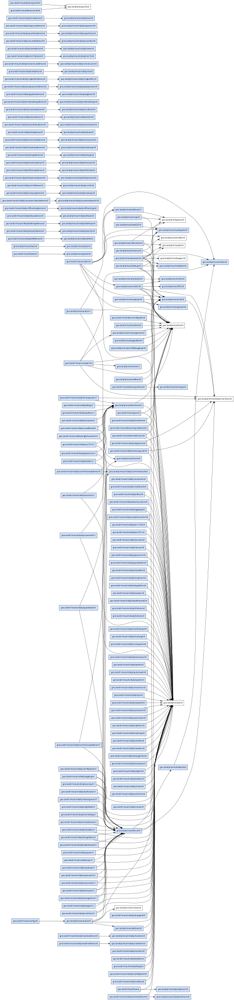

# moul/gno-contracts

[](https://github.com/moul/gno-contracts/actions/workflows/ci.yml)

**moul's personal [gno.land](https://gno.land) contracts** — every `p/moul/*`
package and `r/moul/*` realm, developed in one place, **versioned from day one**,
**self-contained** (dependencies vendored), and **continuously tested against
gno master**.

This repository is the home for contracts that previously lived in the
`gnolang/gno` monorepo under `examples/gno.land/{p,r}/moul/*`. It is designed so
that a single `git clone` + a gno toolchain is enough to build, test, lint, and
publish everything.

## Features

- **Mandatory versioning** — every contract is `.../<name>/vN`; breaking changes
  ship as a new `vN`, never an in-place edit. Originals that no longer build on
  master are kept as `ignore = true` (archived, 💤, skipped by CI) beside a ported
  `vN+1`.
- **Autonomous builds** — external `gno.land/*` deps are vendored; only the gno
  stdlibs come from the toolchain. One clone builds offline, independent of
  monorepo drift.
- **CI against gno master** — every package is `gno lint`-ed and `gno test`-ed on
  each PR; `make sync` reports drift from the upstream monorepo copies.
- **Self-maintaining catalog** — [`contracts.json`](./contracts.json) + the table
  below, every per-package README (docs + repo link + disclaimer + embedded
  dependency graph), and the `_assets/` graphs are **regenerated after merge** by a
  bot, so PRs carry only source and never conflict on generated files.
- **Dependency graphs** — per-package and a global graph of everything, in
  [`_assets/`](./_assets).
- **On-chain status** — the table shows where each contract is published
  (✅ `/v1`, 📦 un-versioned monorepo path), refreshed by a scheduled job.
- **PR bots** — a sticky **analysis report** (new/updated packages, sizes, test
  counts, ⚠️/🔥 signals), automatic **path labels** (`p`/`r`/`meta`), and a
  **live realm preview** (below).
- **Publishing** — [`gnopublish`](./tools/gnopublish) queries a network for what's
  missing, orders by dependency, and broadcasts (one tx per package or merged),
  asking your gnokey password once.

### 🖼️ Realm previews on every PR

When a PR touches a realm, a bot renders it with **gnodev → static gnoweb** and
publishes a browsable snapshot to `https://moul.github.io/gno-contracts/pr-<N>/`,
linked from a sticky PR comment — so reviewers can *see* the rendered output
without checking out the branch. The preview is removed when the PR closes.
(See [`tools/gnopreview`](./tools/gnopreview).)

## Layout

```
p/moul/<name>/v1/         pure packages          → gno.land/p/moul/<name>/v1
r/moul/<name>/v1/         realms                 → gno.land/r/moul/<name>/v1
vendor/gno.land/...       vendored dependencies (committed, autonomous)
tools/                    Go maintenance CLI (manifest, readme, vendor, sync, publish)
contracts.json           the contract catalog (source of truth for the table below)
gnowork.toml             gno workspace marker (enables local package resolution)
Makefile                 test / lint / deps / gen / sync / publish
```

### Versioning (mandatory)

**Every** contract lives under an explicit version segment: `.../<name>/v1`,
`/v2`, `/v3`, … There is no un-versioned contract. A breaking change ships as a
new `vN` directory; the old version keeps working for existing callers. This is
adopted from the very first commit so callers can always pin, and so drift from
the (un-versioned) monorepo copies can be tracked and bumped deliberately.

### Autonomy (vendored dependencies)

`gnowork.toml` makes the whole repo one gno workspace, so `gno.land/p/moul/*`
imports resolve locally. External `gno.land/*` dependencies are copied into
`vendor/gno.land/...` (each with its `gnomod.toml`) by `make deps`, so the repo
resolves them without relying on `$GNOROOT/examples`. Only the gno **stdlibs**
come from the toolchain (`$GNOROOT`).

## Usage

```sh
export GNOROOT=/path/to/gnolang/gno     # a gno master checkout (stdlibs + gno binary)

make deps        # vendor external dependencies into vendor/
make test        # gno test every p/moul and r/moul package
make lint        # gno lint every package
make gen         # refresh contracts.json + the table below
make sync        # report drift vs the monorepo (someone changed my contract?)
make publish     # print dependency-ordered publish plan (-net/-check for status)
make upload ARGS="-net portal-loop -key mykey -dry-run ./..."   # broadcast (gnopublish)
make help        # list all targets
```

## Contracts

<!-- BEGIN CONTRACTS TABLE (generated by `make readme`; do not edit by hand) -->

| Package | topaz | betanet | staging | Monorepo | Deps |
|---|---|---|---|---|---|
| [`p/moul/addrset/v1`](p/moul/addrset/v1) 📦 | [✅🗄️](https://topaz.testnets.gno.land/p/moul/addrset/v1) | [🗄️](https://gno.land/p/moul/addrset) | [🗄️](https://staging.gno.land/p/moul/addrset) | [src](https://github.com/gnolang/gno/tree/master/examples/gno.land/p/moul/addrset) | 1 |
| [`p/moul/authz/v1`](p/moul/authz/v1) 📦 | [✅🗄️](https://topaz.testnets.gno.land/p/moul/authz/v1) | [🗄️](https://gno.land/p/moul/authz) | [🗄️](https://staging.gno.land/p/moul/authz) | [src](https://github.com/gnolang/gno/tree/master/examples/gno.land/p/moul/authz) | 5 |
| [`p/moul/collection/v1`](p/moul/collection/v1) 📦 💤 | — | — | — | — | 3 |
| [`p/moul/collection/v2`](p/moul/collection/v2) 📦 | [✅](https://topaz.testnets.gno.land/p/moul/collection/v2) | — | — | — | 3 |
| [`p/moul/cow/v1`](p/moul/cow/v1) 📦 💤 | — | — | — | — | — |
| [`p/moul/cow/v2`](p/moul/cow/v2) 📦 | [✅](https://topaz.testnets.gno.land/p/moul/cow/v2) | — | — | — | — |
| [`p/moul/debug/v1`](p/moul/debug/v1) 📦 💤 | — | — | — | — | 4 |
| [`p/moul/debug/v2`](p/moul/debug/v2) 📦 | [✅](https://topaz.testnets.gno.land/p/moul/debug/v2) | — | — | — | 4 |
| [`p/moul/deque/v1`](p/moul/deque/v1) 📦 💤 | — | — | — | — | — |
| [`p/moul/deque/v2`](p/moul/deque/v2) 📦 | [✅](https://topaz.testnets.gno.land/p/moul/deque/v2) | — | — | — | — |
| [`p/moul/dynreplacer/v1`](p/moul/dynreplacer/v1) 📦 | [✅](https://topaz.testnets.gno.land/p/moul/dynreplacer/v1) | — | [🗄️](https://staging.gno.land/p/moul/dynreplacer) | [src](https://github.com/gnolang/gno/tree/master/examples/gno.land/p/moul/dynreplacer) | — |
| [`p/moul/entropy/v1`](p/moul/entropy/v1) 📦 | [✅](https://topaz.testnets.gno.land/p/moul/entropy/v1) | — | — | — | — |
| [`p/moul/errs/v1`](p/moul/errs/v1) 📦 💤 | — | — | — | — | — |
| [`p/moul/errs/v2`](p/moul/errs/v2) 📦 | [✅](https://topaz.testnets.gno.land/p/moul/errs/v2) | — | — | — | — |
| [`p/moul/fifo/v1`](p/moul/fifo/v1) 📦 | [✅🗄️](https://topaz.testnets.gno.land/p/moul/fifo/v1) | — | [🗄️](https://staging.gno.land/p/moul/fifo) | [src](https://github.com/gnolang/gno/tree/master/examples/gno.land/p/moul/fifo) | — |
| [`p/moul/fp/v1`](p/moul/fp/v1) 📦 💤 | — | — | — | — | — |
| [`p/moul/fp/v2`](p/moul/fp/v2) 📦 | [✅](https://topaz.testnets.gno.land/p/moul/fp/v2) | — | — | — | — |
| [`p/moul/greet/v1`](p/moul/greet/v1) 📦 | [✅](https://topaz.testnets.gno.land/p/moul/greet/v1) | — | — | — | — |
| [`p/moul/helplink/v1`](p/moul/helplink/v1) 📦 | [✅🗄️](https://topaz.testnets.gno.land/p/moul/helplink/v1) | [🗄️](https://gno.land/p/moul/helplink) | [🗄️](https://staging.gno.land/p/moul/helplink) | [src](https://github.com/gnolang/gno/tree/master/examples/gno.land/p/moul/helplink) | 1 |
| [`p/moul/md/v1`](p/moul/md/v1) 📦 | [✅🗄️](https://topaz.testnets.gno.land/p/moul/md/v1) | [🗄️](https://gno.land/p/moul/md) | [🗄️](https://staging.gno.land/p/moul/md) | [src](https://github.com/gnolang/gno/tree/master/examples/gno.land/p/moul/md) | 1 |
| [`p/moul/mdlist/v1`](p/moul/mdlist/v1) 📦 💤 | — | — | — | — | 1 |
| [`p/moul/mdlist/v2`](p/moul/mdlist/v2) 📦 | [✅](https://topaz.testnets.gno.land/p/moul/mdlist/v2) | — | — | — | 1 |
| [`p/moul/mdtable/v1`](p/moul/mdtable/v1) 📦 | [✅🗄️](https://topaz.testnets.gno.land/p/moul/mdtable/v1) | [🗄️](https://gno.land/p/moul/mdtable) | [🗄️](https://staging.gno.land/p/moul/mdtable) | [src](https://github.com/gnolang/gno/tree/master/examples/gno.land/p/moul/mdtable) | — |
| [`p/moul/memo/v1`](p/moul/memo/v1) 📦 💤 | — | — | — | — | 2 |
| [`p/moul/memo/v2`](p/moul/memo/v2) 📦 | [✅](https://topaz.testnets.gno.land/p/moul/memo/v2) | — | — | — | 2 |
| [`p/moul/nestedpkg/v1`](p/moul/nestedpkg/v1) 📦 | [✅](https://topaz.testnets.gno.land/p/moul/nestedpkg/v1) | — | — | — | — |
| [`p/moul/once/v1`](p/moul/once/v1) 📦 | [✅🗄️](https://topaz.testnets.gno.land/p/moul/once/v1) | [🗄️](https://gno.land/p/moul/once) | [🗄️](https://staging.gno.land/p/moul/once) | [src](https://github.com/gnolang/gno/tree/master/examples/gno.land/p/moul/once) | — |
| [`p/moul/printfdebugging/v1`](p/moul/printfdebugging/v1) 📦 💤 | — | — | — | — | 1 |
| [`p/moul/printfdebugging/v2`](p/moul/printfdebugging/v2) 📦 | [✅](https://topaz.testnets.gno.land/p/moul/printfdebugging/v2) | — | — | — | 1 |
| [`p/moul/realmpath/v1`](p/moul/realmpath/v1) 📦 | [✅🗄️](https://topaz.testnets.gno.land/p/moul/realmpath/v1) | [🗄️](https://gno.land/p/moul/realmpath) | [🗄️](https://staging.gno.land/p/moul/realmpath) | [src](https://github.com/gnolang/gno/tree/master/examples/gno.land/p/moul/realmpath) | — |
| [`p/moul/svg/v1`](p/moul/svg/v1) 📦 | [✅](https://topaz.testnets.gno.land/p/moul/svg/v1) | — | — | — | 3 |
| [`p/moul/txlink/v1`](p/moul/txlink/v1) 📦 | [✅🗄️](https://topaz.testnets.gno.land/p/moul/txlink/v1) | [🗄️](https://gno.land/p/moul/txlink) | [🗄️](https://staging.gno.land/p/moul/txlink) | [src](https://github.com/gnolang/gno/tree/master/examples/gno.land/p/moul/txlink) | — |
| [`p/moul/typeutil/v1`](p/moul/typeutil/v1) 📦 | [✅🗄️](https://topaz.testnets.gno.land/p/moul/typeutil/v1) | [🗄️](https://gno.land/p/moul/typeutil) | [🗄️](https://staging.gno.land/p/moul/typeutil) | [src](https://github.com/gnolang/gno/tree/master/examples/gno.land/p/moul/typeutil) | — |
| [`p/moul/ulist/lplist/v1`](p/moul/ulist/lplist/v1) 📦 | [✅](https://topaz.testnets.gno.land/p/moul/ulist/lplist/v1) | — | — | — | 1 |
| [`p/moul/ulist/v1`](p/moul/ulist/v1) 📦 | [✅🗄️](https://topaz.testnets.gno.land/p/moul/ulist/v1) | [🗄️](https://gno.land/p/moul/ulist) | [🗄️](https://staging.gno.land/p/moul/ulist) | [src](https://github.com/gnolang/gno/tree/master/examples/gno.land/p/moul/ulist) | — |
| [`p/moul/web25/v1`](p/moul/web25/v1) 📦 💤 | — | — | — | — | 1 |
| [`p/moul/web25/v2`](p/moul/web25/v2) 📦 | [✅](https://topaz.testnets.gno.land/p/moul/web25/v2) | — | — | — | 1 |
| [`p/moul/x/daily/piglatin/v1`](p/moul/x/daily/piglatin/v1) 📦 | — | — | — | — | — |
| [`p/moul/x/daily/ratelimit/v1`](p/moul/x/daily/ratelimit/v1) 📦 | — | — | — | — | 1 |
| [`p/moul/xmath/v1`](p/moul/xmath/v1) 📦 💤 | — | — | — | — | — |
| [`p/moul/xmath/v2`](p/moul/xmath/v2) 📦 | [✅](https://topaz.testnets.gno.land/p/moul/xmath/v2) | — | — | — | — |
| [`r/moul/demo/args/v1`](r/moul/demo/args/v1) 🏛️ 💤 | — | — | — | — | — |
| [`r/moul/demo/args/v2`](r/moul/demo/args/v2) 🏛️ | — | — | — | — | — |
| [`r/moul/demo/data/v1`](r/moul/demo/data/v1) 🏛️ 💤 | — | — | — | — | — |
| [`r/moul/demo/data/v2`](r/moul/demo/data/v2) 🏛️ | — | — | — | — | — |
| [`r/moul/demo/gnoface/v1`](r/moul/demo/gnoface/v1) 🏛️ | — | — | — | — | 2 |
| [`r/moul/demo/grc20/v1`](r/moul/demo/grc20/v1) 🏛️ 💤 | — | — | — | — | 1 |
| [`r/moul/demo/grc20/v2`](r/moul/demo/grc20/v2) 🏛️ | — | — | — | — | 1 |
| [`r/moul/demo/hello/v1`](r/moul/demo/hello/v1) 🏛️ 💤 | — | — | — | — | — |
| [`r/moul/demo/hello/v2`](r/moul/demo/hello/v2) 🏛️ | — | — | — | — | — |
| [`r/moul/demo/importdemo/v1`](r/moul/demo/importdemo/v1) 🏛️ 💤 | — | — | — | — | 2 |
| [`r/moul/demo/importdemo/v2`](r/moul/demo/importdemo/v2) 🏛️ | — | — | — | — | 1 |
| [`r/moul/demo/microposts/v1`](r/moul/demo/microposts/v1) 🏛️ 💤 | — | — | — | — | — |
| [`r/moul/demo/microposts/v2`](r/moul/demo/microposts/v2) 🏛️ | — | — | — | — | — |
| [`r/moul/demo/millipede/v1`](r/moul/demo/millipede/v1) 🏛️ | — | — | — | — | 1 |
| [`r/moul/demo/render/v1`](r/moul/demo/render/v1) 🏛️ 💤 | — | — | — | — | — |
| [`r/moul/demo/render/v2`](r/moul/demo/render/v2) 🏛️ | — | — | — | — | — |
| [`r/moul/demo/vault/v1`](r/moul/demo/vault/v1) 🏛️ 💤 | — | — | — | — | 2 |
| [`r/moul/demo/vault/v2`](r/moul/demo/vault/v2) 🏛️ | — | — | — | — | 1 |
| [`r/moul/demo/wikicoin/v1`](r/moul/demo/wikicoin/v1) 🏛️ 💤 | — | — | — | — | 2 |
| [`r/moul/demo/wikicoin/v2`](r/moul/demo/wikicoin/v2) 🏛️ | — | — | — | — | 2 |
| [`r/moul/gns/v1`](r/moul/gns/v1) 🏛️ | — | — | — | — | 2 |
| [`r/moul/hello/v1`](r/moul/hello/v1) 🏛️ | — | — | — | — | 1 |
| [`r/moul/outfmt/v1`](r/moul/outfmt/v1) 🏛️ 💤 | — | — | — | — | 1 |
| [`r/moul/outfmt/v2`](r/moul/outfmt/v2) 🏛️ | — | — | — | — | 1 |
| [`r/moul/sapin/v1`](r/moul/sapin/v1) 🏛️ | — | — | — | — | — |
| [`r/moul/x/daily/blog/v1`](r/moul/x/daily/blog/v1) 🏛️ | — | — | — | — | 1 |
| [`r/moul/x/daily/bloomfilter/v1`](r/moul/x/daily/bloomfilter/v1) 🏛️ | — | — | — | — | — |
| [`r/moul/x/daily/bullscows/v1`](r/moul/x/daily/bullscows/v1) 🏛️ | — | — | — | — | — |
| [`r/moul/x/daily/calc/v1`](r/moul/x/daily/calc/v1) 🏛️ | — | — | — | — | — |
| [`r/moul/x/daily/coinflipduel/v1`](r/moul/x/daily/coinflipduel/v1) 🏛️ | — | — | — | — | 1 |
| [`r/moul/x/daily/collatz/v1`](r/moul/x/daily/collatz/v1) 🏛️ | — | — | — | — | 1 |
| [`r/moul/x/daily/connect4/v1`](r/moul/x/daily/connect4/v1) 🏛️ | — | — | — | — | 1 |
| [`r/moul/x/daily/counter/v1`](r/moul/x/daily/counter/v1) 🏛️ | — | — | — | — | — |
| [`r/moul/x/daily/crowdfund/v1`](r/moul/x/daily/crowdfund/v1) 🏛️ 🚧 | — | — | — | — | 1 |
| [`r/moul/x/daily/dice/v1`](r/moul/x/daily/dice/v1) 🏛️ | — | — | — | — | 1 |
| [`r/moul/x/daily/dutchauction/v1`](r/moul/x/daily/dutchauction/v1) 🏛️ | — | — | — | — | 1 |
| [`r/moul/x/daily/eggling/v1`](r/moul/x/daily/eggling/v1) 🏛️ | — | — | — | — | 1 |
| [`r/moul/x/daily/eightball/v1`](r/moul/x/daily/eightball/v1) 🏛️ | — | — | — | — | — |
| [`r/moul/x/daily/englishauction/v1`](r/moul/x/daily/englishauction/v1) 🏛️ 🚧 | — | — | — | — | 1 |
| [`r/moul/x/daily/erc1155/v1`](r/moul/x/daily/erc1155/v1) 🏛️ | — | — | — | — | 1 |
| [`r/moul/x/daily/erc20/v1`](r/moul/x/daily/erc20/v1) 🏛️ | — | — | — | — | — |
| [`r/moul/x/daily/erc721/v1`](r/moul/x/daily/erc721/v1) 🏛️ 🚧 | — | — | — | — | 1 |
| [`r/moul/x/daily/escrow/v1`](r/moul/x/daily/escrow/v1) 🏛️ | — | — | — | — | 1 |
| [`r/moul/x/daily/faucet/v1`](r/moul/x/daily/faucet/v1) 🏛️ | — | — | — | — | 1 |
| [`r/moul/x/daily/governor/v1`](r/moul/x/daily/governor/v1) 🏛️ 🚧 | — | — | — | — | 1 |
| [`r/moul/x/daily/guestbook/v1`](r/moul/x/daily/guestbook/v1) 🏛️ | — | — | — | — | 1 |
| [`r/moul/x/daily/handles/v1`](r/moul/x/daily/handles/v1) 🏛️ | — | — | — | — | 1 |
| [`r/moul/x/daily/hangman/v1`](r/moul/x/daily/hangman/v1) 🏛️ | — | — | — | — | 1 |
| [`r/moul/x/daily/kingofdice/v1`](r/moul/x/daily/kingofdice/v1) 🏛️ | — | — | — | — | 1 |
| [`r/moul/x/daily/kudos/v1`](r/moul/x/daily/kudos/v1) 🏛️ | — | — | — | — | 1 |
| [`r/moul/x/daily/leaderboard/v1`](r/moul/x/daily/leaderboard/v1) 🏛️ | — | — | — | — | 1 |
| [`r/moul/x/daily/life/v1`](r/moul/x/daily/life/v1) 🏛️ | — | — | — | — | — |
| [`r/moul/x/daily/linktree/v1`](r/moul/x/daily/linktree/v1) 🏛️ | — | — | — | — | 1 |
| [`r/moul/x/daily/lottery/v1`](r/moul/x/daily/lottery/v1) 🏛️ 🚧 | — | — | — | — | 1 |
| [`r/moul/x/daily/lru/v1`](r/moul/x/daily/lru/v1) 🏛️ | — | — | — | — | — |
| [`r/moul/x/daily/memory/v1`](r/moul/x/daily/memory/v1) 🏛️ | — | — | — | — | — |
| [`r/moul/x/daily/merkledrop/v1`](r/moul/x/daily/merkledrop/v1) 🏛️ 🚧 | — | — | — | — | 1 |
| [`r/moul/x/daily/microblog/v1`](r/moul/x/daily/microblog/v1) 🏛️ | — | — | — | — | — |
| [`r/moul/x/daily/moodstone/v1`](r/moul/x/daily/moodstone/v1) 🏛️ | — | — | — | — | — |
| [`r/moul/x/daily/multisig/v1`](r/moul/x/daily/multisig/v1) 🏛️ | — | — | — | — | 1 |
| [`r/moul/x/daily/numguess/v1`](r/moul/x/daily/numguess/v1) 🏛️ | — | — | — | — | 1 |
| [`r/moul/x/daily/piglatindemo/v1`](r/moul/x/daily/piglatindemo/v1) 🏛️ | — | — | — | — | 1 |
| [`r/moul/x/daily/polls/v1`](r/moul/x/daily/polls/v1) 🏛️ | — | — | — | — | 1 |
| [`r/moul/x/daily/quotes/v1`](r/moul/x/daily/quotes/v1) 🏛️ | — | — | — | — | — |
| [`r/moul/x/daily/ratelimitdemo/v1`](r/moul/x/daily/ratelimitdemo/v1) 🏛️ | — | — | — | — | 1 |
| [`r/moul/x/daily/reactions/v1`](r/moul/x/daily/reactions/v1) 🏛️ | — | — | — | — | 1 |
| [`r/moul/x/daily/ringlog/v1`](r/moul/x/daily/ringlog/v1) 🏛️ | — | — | — | — | — |
| [`r/moul/x/daily/rps/v1`](r/moul/x/daily/rps/v1) 🏛️ | — | — | — | — | 1 |
| [`r/moul/x/daily/rpsduel/v1`](r/moul/x/daily/rpsduel/v1) 🏛️ | — | — | — | — | 1 |
| [`r/moul/x/daily/rpsmatch/v1`](r/moul/x/daily/rpsmatch/v1) 🏛️ | — | — | — | — | 1 |
| [`r/moul/x/daily/rpsoracle/v1`](r/moul/x/daily/rpsoracle/v1) 🏛️ | — | — | — | — | 1 |
| [`r/moul/x/daily/splitter/v1`](r/moul/x/daily/splitter/v1) 🏛️ | — | — | — | — | 1 |
| [`r/moul/x/daily/stack/v1`](r/moul/x/daily/stack/v1) 🏛️ | — | — | — | — | — |
| [`r/moul/x/daily/staking/v1`](r/moul/x/daily/staking/v1) 🏛️ 🚧 | — | — | — | — | 1 |
| [`r/moul/x/daily/tamagotchi/v1`](r/moul/x/daily/tamagotchi/v1) 🏛️ | — | — | — | — | 1 |
| [`r/moul/x/daily/tictactoe/v1`](r/moul/x/daily/tictactoe/v1) 🏛️ | — | — | — | — | 1 |
| [`r/moul/x/daily/timecapsule/v1`](r/moul/x/daily/timecapsule/v1) 🏛️ | — | — | — | — | 2 |
| [`r/moul/x/daily/timelock/v1`](r/moul/x/daily/timelock/v1) 🏛️ 🚧 | — | — | — | — | 2 |
| [`r/moul/x/daily/todos/v1`](r/moul/x/daily/todos/v1) 🏛️ | — | — | — | — | 1 |
| [`r/moul/x/daily/trivia/v1`](r/moul/x/daily/trivia/v1) 🏛️ | — | — | — | — | 1 |
| [`r/moul/x/daily/urlshort/v1`](r/moul/x/daily/urlshort/v1) 🏛️ | — | — | — | — | 1 |
| [`r/moul/x/daily/vault/v1`](r/moul/x/daily/vault/v1) 🏛️ | — | — | — | — | 1 |
| [`r/moul/x/daily/vestoken/v1`](r/moul/x/daily/vestoken/v1) 🏛️ | — | — | — | — | — |
| [`r/moul/x/daily/wordle/v1`](r/moul/x/daily/wordle/v1) 🏛️ | — | — | — | — | — |
| [`r/moul/x/daily/wrapped/v1`](r/moul/x/daily/wrapped/v1) 🏛️ | — | — | — | — | 1 |

_📦 pkg · 🏛️ realm · 🚧 draft · 💤 archived (`ignore = true` in gnomod, skipped by CI; kept for reference, superseded by a later version)._

_On-chain status last checked: 2026-07-26T13:53:32Z (✅ = /v1, 🗄️ = un-versioned monorepo path)._

<!-- END CONTRACTS TABLE -->

The table is generated from [`contracts.json`](./contracts.json) by
`make readme`; CI fails if it is stale (`make check`). Descriptions and upload
status are hand-authored/queried and preserved across regenerations.

## Dependency graph

Whole-repo dependency graph (generated into [`_assets/`](./_assets) by
`make graph`; each package also has its own `_assets/<pkgpath>/deps.svg`):



## Contributing / agents

This repo is built to be worked on by humans and coding agents alike. Start with
[`AGENTS.md`](./AGENTS.md) (and [`CLAUDE.md`](./CLAUDE.md), which points to it)
for the conventions: versioning, workspace/vendor model, how to add a contract,
and the invariants CI enforces.

## License

See [`LICENSE`](./LICENSE) — distributed under the GNO Network General Public
License, consistent with `gnolang/gno`.
