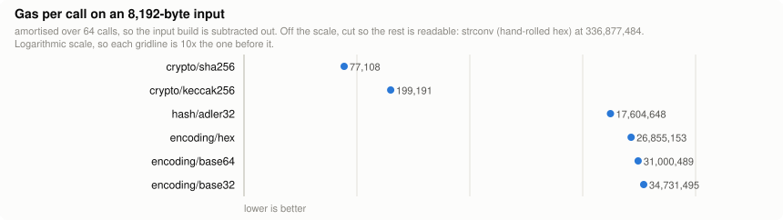
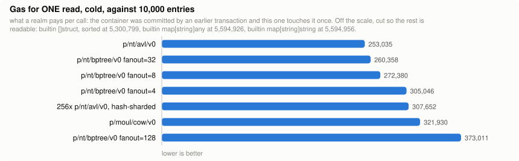
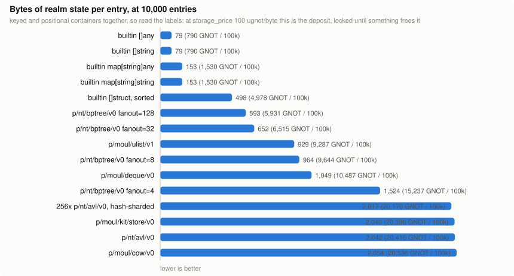

# gnobench

**What a gno construct costs, measured.** Not estimated, not reasoned about: run, recorded with
the machine and the gno revision that produced it, and regenerated into a report nobody edits
by hand.

```sh
make bench                 # measure the storage suite, merge into this machine's file
make report                # regenerate reports/, the charts and this README, from disk
make list                  # what suites, candidates and workloads exist
```

`GNOROOT` must point at a `gnolang/gno` checkout; it supplies the stdlibs. Nothing else is
required and nothing touches the network.

## Results

The section below is **generated**: `make report` rewrites it from `results/`, so the front
page can never disagree with the data behind it. The charts link into the full report; the
dashboard is filterable by capability.

<!-- BEGIN RESULTS (generated by `make report`; do not edit by hand) -->

_Every figure below is read out of `results/`. Do not edit: run `make report`._

### `digest`: Hashing and encoding a realm's bytes

- **112** measured rows on `darwin-arm64-apple-m4-max-16c` (darwin/arm64, Apple M4 Max, 16 cores, 64 GB), Go 1.25.9, gno `1fc4c140e (2026-09-14)`, last updated 2026-09-29.
- On an 8,192-byte input: **`crypto/sha256` at 77,108 gas per call**, against `strconv (hand-rolled hex)` at 336,877,484. A **4,369x** spread, and it tracks native against interpreted, not algorithm against algorithm.

<a href="reports/digest.md#every-workload">
  <picture>
    <source media="(prefers-color-scheme: dark)" srcset="reports/digest-per-call-dark.svg">
    
  </picture>
</a>

[Full report](reports/digest.md) `·` [Dashboard, filterable](reports/digest.html) `·` [Raw rows](results/digest/)

### `storage`: Where a realm puts its data

- **1,478** measured rows on `darwin-arm64-apple-m4-max-16c` (darwin/arm64, Apple M4 Max, 16 cores, 64 GB), Go 1.25.9, gno `1fc4c140e (2026-09-14)`, last updated 2026-09-29.
- One cold read against 10,000 entries: **`p/nt/avl/v0` at 253,035 gas**, against `builtin map[string]string` at 5,594,956. A **22.1x** spread.
- Storage per entry, keyed containers: **`builtin map[string]any` at 153 bytes**, against `p/moul/cow/v0` at 2,054. At 100k entries that is 1,530 GNOT of deposit against 20,536.
- A `builtin map` read looks like 4,239 gas warm and costs **5,594,926 gas** in a real transaction, **1,320x** more, because the whole map is one persisted object and the first touch loads all of it.

<a href="reports/storage.md#one-transaction-one-operation">
  <picture>
    <source media="(prefers-color-scheme: dark)" srcset="reports/storage-tx-read-dark.svg">
    
  </picture>
</a>

<a href="reports/storage.md#storage-per-entry">
  <picture>
    <source media="(prefers-color-scheme: dark)" srcset="reports/storage-bytes-dark.svg">
    
  </picture>
</a>

**Cheapest per size**, one cold transaction, one operation, gas:

| operation | n = 100 | n = 1,000 | n = 10,000 | changes hands |
|---|---|---|---|---|
| tx_read | `builtin map[string]any`<br>62,642 | `p/nt/avl/v0`<br>209,978 | `p/nt/avl/v0`<br>253,035 | before 1,000 |
| tx_write | `builtin map[string]any`<br>118,396 | `p/nt/bptree/v0 fanout=8`<br>283,170 | `p/nt/bptree/v0 fanout=32`<br>340,196 | before 1,000 |
| tx_insert | `builtin map[string]any`<br>119,327 | `p/nt/bptree/v0 fanout=8`<br>313,337 | `p/moul/cow/v0`<br>513,349 | before 1,000 |
| tx_delete | `builtin map[string]any`<br>122,650 | `p/nt/bptree/v0 fanout=8`<br>340,377 | `p/nt/bptree/v0 fanout=32`<br>405,677 | before 1,000 |
| tx_page10 | `builtin []struct, sorted`<br>13,310 | `p/nt/bptree/v0 fanout=128`<br>36,455 | `p/nt/bptree/v0 fanout=32`<br>39,414 | before 1,000 |

[Full report](reports/storage.md) `·` [Dashboard, filterable](reports/storage.html) `·` [Raw rows](results/storage/)

<!-- END RESULTS -->

## What it measures

Every measurement is one generated gno filetest run through gnovm's own filetest runner, which
returns three things:

| axis | where it comes from | how far to trust it |
|---|---|---|
| **gas** | the VM's meter: CPU cycles, allocations, store reads and writes, in one figure | comparable between rows, **not** mainnet gas (the filetest meter is infinite and the test gas config is not the chain's) |
| **bytes** | `Store.RealmStorageDiffs()`, the net byte delta of persisted realm objects | real: at `storage_price` 100 ugnot/byte this **is** the deposit |
| **wall** | timed around the call | carries a fixed per-run type-check cost, so only large deltas mean anything |

## Warm and cold, which is the whole point

A benchmark that builds a container and then reads it **in the same run** measures nothing a
realm will ever experience. Every object it touches is already live in the VM's
per-transaction object cache.

So each workload declares a mode:

- **warm**: built and measured inside one run.
- **cold**: built during package initialisation, which the filetest runner commits and then
  reconstructs the machine from ("Clear store cache and reconstruct machine from committed
  info (mimicking on-chain behaviour)", `gnovm/pkg/test/filetest.go`). `main` then starts with
  an empty object cache and deserialises every object it touches, exactly as a transaction
  against a deployed realm does.

The difference is not a rounding error. A container held in **one** persisted object is O(1)
warm and **O(n) cold**, because the first touch loads all of it. The `tx_*` workloads measure
the realistic unit: one transaction, one operation, nothing cached.

## Why the numbers are comparable

1. **Baseline subtraction.** Every workload names a baseline whose body is an exact prefix of
   its own, so `tx_read` minus `tx_base` is one read and nothing else.
2. **Identical inputs.** Fixed-width keys, so lexicographic order equals numeric order; one
   deterministic Fisher-Yates over xorshift64, seeded the same for every candidate.
3. **Nothing incidental is persisted.** The key and permutation slices are function-local.
4. **Every scenario asserts its own postcondition.** An adapter that silently measures nothing
   panics instead of posting a great number.
5. **Repeats must agree.** Gas and bytes are deterministic; a row that moves between repeats is
   flagged, never averaged.

## Results are per machine, and they append

```
results/<suite>/<machine-id>.json
```

The machine id is OS, arch, CPU model and core count. Re-running on the same machine **updates
rows in place**; running on a different machine writes a **different file** and both are kept.
A scenario nobody has run yet is simply absent, so adding a candidate or a workload is additive.

Every row carries the date it was measured and the gno commit it was measured against. The
report computes its own warnings from that: rows measured against more than one gno revision,
rows over 30 days old, rows that did not reproduce, rows that failed.

`reports/<suite>.md`, `reports/<suite>.html`, `reports/*.svg` and the **Results** section of this
README are all **generated**. Never edit them; run `make report`. `make report-check` fails if
they disagree with `results/`, and CI runs it on every pull request before it measures
anything.

### Releasing

There is no separate artefact to ship: **the committed reports are the release.** CI
re-measures the whole suite weekly against gno master and commits `results/` and `reports/`
when a number moves, so the files in this repository are always the current answer and their
history is the record of how the answer changed. Every row carries the gno commit and the
gnobench commit that produced it, so any figure can be traced back to the two revisions it
depends on.

## Suites

| suite | what it asks |
|---|---|
| `storage` | where a realm should put its data: 19 key/value and positional containers |

A second suite is a new file, not a new tool: a `Suite` value with its candidates, its
workloads and its facets, registered from an `init`.

## Adding a candidate

One entry in `suite_storage.go`: the import, the declaration of the empty container, and the
op set its group's workloads call.

| group | ops |
|---|---|
| `kv` | `opSet` `opGet` `opDel` `opIter` `opRange` `opOffset` `opSize` |
| `list` | `opPush` `opAt` `opSetAt` `opDelAt` `opIter` `opCompact` `opSize` |

`Skip` names the workloads it cannot answer and why. `Values` restricts which value shapes it
takes. `Tags` are what the dashboard's filters are built from, as `facet:value` pairs, so a
reader can ask for "key order and supports range" and see only those.

Names are **import paths**, always. `avl` reads like a language feature; `p/nt/avl/v0` reads
like what it is, a package with a version and an author, that a realm chose and could choose
differently.

## Files

| file | what |
|---|---|
| `main.go` | the CLI: `run`, `report`, `list` |
| `run.go` | generation, execution, baseline subtraction |
| `template.go` | the single gno file every measurement is rendered into, and the warm/cold placement |
| `env.go` | machine and toolchain detection |
| `store.go` | the per-machine result files and the staleness warnings |
| `report.go` | the generated markdown |
| `svg.go` | the static charts the README embeds, one file per theme |
| `readme.go` | the README's generated results region |
| `html.go`, `page.go` | the generated dashboard |
| `suite.go` | the generic suite shape |
| `suite_storage.go`, `suite_storage_workloads.go` | the storage suite |
